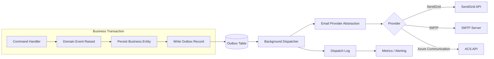
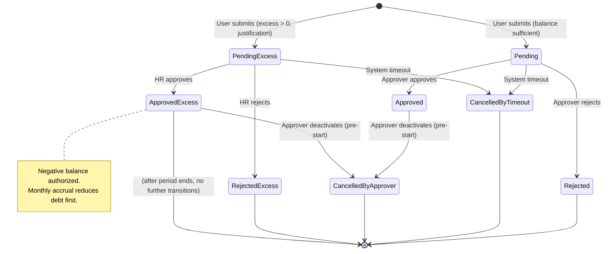

# NovaLeave — Post-MVP Evolution Proposal

**Status**: Draft — Non-Normative Proposal  
**Date**: 2026-07-27  
**Relation to MVP**: Post-MVP evolution document; does not alter current MVP scope  
**Classification**: Proposal subject to Product Owner approval, independent functional specification, ADR where architectural impact exists, and MAJOR constitutional amendment (v7.0.0) before implementation  

---

## 1. Purpose

This document proposes three future capabilities for NovaLeave beyond the MVP baseline defined in Constitution v6.0.0 and `specs/001-leave-management-mvp/spec.md`. It is a **prospective design artifact** intended to inform Product Owner decisions, architectural planning, and future specification work.

**This document is explicitly NOT:**

- Authorized for implementation
- A functional specification
- A constitutional amendment
- Normative for the current MVP

Any capability described herein requires: (a) Product Owner approval, (b) a dedicated functional specification, (c) ADR(s) for architectural impacts, and (d) a MAJOR constitutional amendment (previously v7.0.0) where the proposal conflicts with Constitution v6.0.0.

---

## 2. Context and Current Baseline

### 2.1 MVP Scope Summary (Constitution v6.0.0)

| Aspect | Current MVP Rule |
|--------|------------------|
| **Roles** | `User`, `Approver`, `HR` (combinable) |
| **HR Permissions** | Read-only: requests, calendar, balances, audit; Approver capability toggle (`canResolveRequests`) only |
| **HR Prohibitions** | MUST NOT approve/reject/deactivate requests; modify balances; assign/remove roles; create/edit/delete users |
| **Request States** | `Pending` → `Approved` / `Rejected` / `CancelledByTimeout`; `Approved` → `CancelledByApprover` (pre-start only) |
| **Balance** | Global, non-negative, accrues 1 day/completed month, non-expiring; Pending reserves; Approval deducts; Deactivation restores |
| **Negative Balance** | Prohibited (BR-012, BR-016, BR-037, SC-003) |
| **Notifications** | Out of scope; poll-only model |
| **User Administration** | Out of scope; seeded via EF Core migration / `IHostedService` only |
| **Audit** | Immutable business + security events; HR capability toggle audited |

### 2.2 Relevant Constitutional Invariants (v6.0.0)

- **§4.3**: HR read-only + capability management only; explicit prohibitions on request resolution, balance modification, role assignment
- **§5 Invariant 1**: Global/available/reserved balance never negative
- **§5 Invariant 7**: Permitted transitions only (no HR resolution transitions)
- **§5 Invariant 10**: Reserve-on-create, deduct-on-approve, restore-on-deactivation
- **§7.4**: Security tests include HR resolution/balance/role/capability violation attempts
- **§16.4**: MAJOR amendment required for incompatible rule changes

---

## 3. Post-MVP Evolution Principles

1. **Constitutional Supremacy**: No post-MVP capability overrides Constitution v6.0.0 without a ratified MAJOR amendment
2. **Specification-First**: Each capability requires an approved functional specification before implementation planning
3. **Architectural Traceability**: Every cross-cutting change requires an ADR
4. **Security by Design**: New administrative powers demand expanded threat modeling, authorization matrices, and audit coverage
5. **Backward Compatibility**: MVP data model and API contracts must remain operable; migrations are additive or versioned
6. **Observable Operations**: All new flows emit structured logs, metrics, and audit events from day one
7. **No Silent Decisions**: Every open question in this document must be resolved by explicit Product Owner / Legal / Security sign-off before specification approval

---

## 4. Scope

### 4.1 In Scope (Proposed Post-MVP Capabilities)

| Capability | Short Description |
|------------|-------------------|
| **User & Role Administration by HR** | CRUD for user accounts (governed deletion), role assignment/removal, activation/deactivation, change history, session invalidation |
| **Email Notifications** | Event-driven email system for request lifecycle, HR exceptions, user/role changes; Outbox pattern; provider abstraction |
| **Insufficient Balance Requests with Monthly Recovery** | User requests excess days → HR authorizes negative balance → monthly accrual pays down debt first → positive balance resumes |

### 4.2 Out of Scope

- Payroll integration, compensation calculations
- Multi-region holiday calendars, half-day/hourly leave types
- Delegation/escalation chains, approval hierarchies
- SSO, SCIM provisioning, external identity providers
- Advanced analytics, AI-assisted planning, predictive balances
- Mobile app, native push notifications
- GDPR/right-to-erasure automation (manual governed process only)
- Physical deletion of requests, audit records, or balance history

---

## 5. Capability 1 — User and Role Administration by HR

### 5.1 Functional Overview

HR gains administrative capabilities over user accounts and roles within a governed framework. The system distinguishes **logical deactivation** (soft delete / status change) from **physical deletion** (irreversible removal), with the latter identified as a **pending legal/retention decision**.

### 5.2 Proposed Operations

| Operation | Description | Auditable |
|-----------|-------------|-----------|
| **Create User** | Provision Identity + business User; assign initial roles; set employment start date | Yes |
| **Edit Administrative Info** | Update display name, email, employment start date, contact metadata | Yes |
| **Activate / Deactivate User** | Toggle `Active` status; cascades to session invalidation; preserves all history | Yes |
| **Delete User (Governed)** | **Logical**: set `DeletedAt`, anonymize PII, retain requests/balances/audit. **Physical**: hard delete — **decision pending** | Yes |
| **Assign Role** | Grant `User` / `Approver` / `HR` to identity; validates combinations | Yes |
| **Revoke Role** | Remove role; if `Approver` revoked, auto-disable `canResolveRequests`; prevents last-admin removal | Yes |
| **Query Change History** | Immutable timeline of all user/role/admin actions with actor, timestamp, before/after | Yes |

### 5.3 Deletion Model — Open Decision

| Aspect | Logical Deletion (Recommended Default) | Physical Deletion |
|--------|----------------------------------------|-------------------|
| **User Record** | `IsDeleted=true`, `DeletedAt`, `DeletedBy`; email anonymized | Row removed |
| **Requests** | Retained; owner shown as "Usuario eliminado" | Orphaned or cascade — **TBD** |
| **Balance** | Retained; movements frozen | **TBD** |
| **Audit/Security Events** | Retained fully (immutable) | **TBD — likely prohibited by retention policy** |
| **Sessions** | Immediately revoked via security stamp update | Immediately revoked |
| **Legal Hold** | Compatible | Requires explicit exclusion |

> **Decision Required**: Physical deletion is NOT provisionally approved. It remains an open question subject to legal retention requirements, audit traceability, and payroll traceability. Logical deletion is the recommended baseline; physical deletion requires explicit legal sign-off and constitutional amendment for audit immutability exceptions.

### 5.4 Protection Rules

- **Last Administrative Identity**: System MUST prevent deactivation/deletion/role-revocation of the last active `HR` + `Approver` combination (or configurable minimum). Requires at least one remaining identity capable of administering the system.
- **Employment History Separation**: Administrative edits (email, name, status) MUST NOT modify `EmploymentStartDate` or accrual-derived balance history. Employment corrections follow a separate governed process with distinct audit trail.

### 5.5 Session Invalidation & Security Stamp

- Any change to `Active` status, roles, or `canResolveRequests` **MUST** update the ASP.NET Core Identity `SecurityStamp` for the affected identity.
- Active sessions for the modified identity **MUST** be invalidated on next request (cookie validation failure → re-authentication).
- Implementation: `UserManager.UpdateSecurityStampAsync` + `SignInManager.RefreshSignInAsync` pattern or equivalent middleware validation.

### 5.6 Concurrency & Confirmation

- All mutating operations use **optimistic concurrency** (`RowVersion` / `xmin`).
- Sensitive operations (deactivate, delete, role assign/revoke) require:
  - Explicit reason (10–500 chars, plain text)
  - Confirmation modal (UI) / idempotency key + confirmation flag (API)
  - HR actor must be `Active` with `HR` role (AUTHZ-011, AUTHZ-012, AUTHZ-016)

### 5.7 Audit Requirements

Every operation creates an immutable audit record with minimum:
- `TimestampUtc`, `ActorId`, `ActorRole`, `Action` (enum: `UserCreated`, `UserEdited`, `UserActivated`, `UserDeactivated`, `UserDeleted`, `RoleAssigned`, `RoleRevoked`), `TargetUserId`, `BeforeValues`, `AfterValues` (redacted PII where appropriate), `Reason`, `CorrelationId`, `RequestId`.

---

## 6. Capability 2 — Email Notifications

### 6.1 Event → Recipient → Purpose Matrix

| Event | Recipient(s) | Purpose |
|-------|--------------|---------|
| Request Created | Approver(s) (eligible, active) | Awareness of new pending request |
| Request Created | Request Owner (User) | Confirmation of submission |
| Request Edited (Pending) | Approver(s) (eligible, active) | Awareness of material change |
| Request Approved | Request Owner | Confirmation + balance impact |
| Request Rejected | Request Owner | Reason + balance unchanged |
| Request Cancelled by Timeout | Request Owner | Automatic cancellation notice |
| Request Deactivated (Pre-start) | Request Owner | Balance restored confirmation |
| Excess Request Submitted (HR Review) | HR (active) | New exception requiring resolution |
| Excess Request Approved by HR | Request Owner | Authorization of negative balance |
| Excess Request Rejected by HR | Request Owner | Denial with reason |
| User Activated/Deactivated | Affected User | Status change awareness |
| Role Assigned/Revoked | Affected User | Permission change awareness |
| Approver Capability Toggled | Affected Approver | Capability change awareness |

> **Note**: "Approver(s)" means all active Approvers with `canResolveRequests=true` except the request owner. No team/hierarchy scoping in MVP or this proposal.

### 6.2 Email Content Rules

- **Language**: Spanish (per Constitution §3.3)
- **Templates**: Razor `.cshtml` or Scriban; localized via `.resx`; compiled at build
- **Sensitive Data Exclusion**: 
  - Request reason **MUST NOT** be included in email body
  - Rejection reason **MAY** be included only for the request owner; excluded for Approver/HR notifications
  - Balance values: available balance only; no accrued/deducted breakdown
- **Links**: Secure, single-use or authentication-required deep links to `/mis-solicitudes/{id}`, `/aprobaciones/{id}`, `/rrhh/solicitudes/{id}`. **NO** action-executing links (no "approve from email").
- **Unsubscribe**: Not applicable (transactional); regulatory footer with contact email.

### 6.3 Delivery Guarantees

| Requirement | Mechanism |
|-------------|-----------|
| **At-least-once delivery** | Outbox Pattern (transactional outbox table + background dispatcher) |
| **Idempotency** | `NotificationIdempotencyKey` per (Event, Recipient, TemplateVersion); dedupe on dispatch |
| **Retry Policy** | Exponential backoff: 1m, 5m, 15m, 1h, 6h, 24h; max 72h; dead-letter after exhaustion |
| **Delivery Outcome Logging** | `NotificationDispatchLog`: `NotificationId`, `Recipient`, `ProviderMessageId`, `Status` (Sent/Failed/Deferred/Bounced/Complained), `Attempt`, `TimestampUtc`, `ErrorCode` |
| **Failure Isolation** | Email dispatch failure **NEVER** rolls back the originating business transaction |

### 6.4 Architecture — Outbox Pattern (Proposed)



- **Outbox Table**: `Id`, `EventType`, `PayloadJson`, `CreatedUtc`, `DispatchedUtc`, `AttemptCount`, `LastError`
- **Dispatcher**: `IHostedService` with polling or `IBackgroundJob` (Hangfire/Quartz) — **provider decision via ADR**
- **Abstraction**: `IEmailSender` with `SendAsync(EmailMessage)`; implementations per provider

### 6.5 Configuration & Secrets

| Setting | Source |
|---------|--------|
| Provider Selection | `NovaLeave:Email:Provider` (enum) + ADR |
| API Keys / Credentials | Azure Key Vault / AWS Secrets Manager / User Secrets (dev) — **never in repo** |
| From Address / Display Name | Config per environment |
| Template Base Path | Embedded resource or `wwwroot/templates/email` |
| Retry/DLQ Thresholds | Configurable; defaults documented |

### 6.6 Observability

- **Metrics**: `emails_queued_total`, `emails_dispatched_total{status}`, `email_dispatch_latency_seconds`, `outbox_backlog`
- **Structured Logs**: Correlation ID propagated; PII redacted
- **Alerts**: Dispatch failure rate > 5% / 5min; outbox backlog > 1000; DLQ growth

### 6.7 Accessibility & Responsive Email

- HTML + plain-text multipart
- Semantic HTML, inline CSS, table-based layout for client compatibility
- Minimum 4.5:1 contrast; scalable fonts; meaningful alt text; no image-only content
- Tested with Litmus / Email on Acid equivalent in CI (future ADR)

### 6.8 Open Decision — Email Provider

> **ADR Required**: Selection among SendGrid, Azure Communication Services, Amazon SES, SMTP relay, or self-hosted. Criteria: cost, deliverability, regional compliance, SPF/DKIM/DMARC management, template API, suppression list handling, webhook event ingestion.

---

## 7. Capability 3 — Insufficient Balance Requests with Monthly Recovery

### 7.1 Functional Flow Overview

```mermaid
flowchart TD
    A[User Submits Request<br/>Days > Available Balance] --> B[Server Calculates<br/>Available / Requested / Excess]
    B --> C{Excess > 0?}
    C -->|No| D[Standard Flow:<br/>Reject per BR-018]
    C -->|Yes| E[Require Excess Justification<br/>(10-500 chars, mandatory)]
    E --> F[Create Request in<br/>PendingExcess state]
    F --> G[Notify HR<br/>(Email + Queue)]
    G --> H[HR Reviews Request]
    H --> I{HR Decision}
    I -->|Approve| J[Transition to<br/>ApprovedExcess<br/>Allow Negative Balance]
    I -->|Reject| K[Transition to<br/>RejectedExcess<br/>Release Reservation]
    J --> L[Monthly Accrual Runs]
    L --> M{Negative Balance?}
    M -->|Yes| N[Apply +1 Day to<br/>Reduce Debt]
    M -->|No| O[Standard Accrual:<br/>Increase Positive Balance]
    N --> P[Record BalanceMovement<br/>Type=ExcessRecovery]
    O --> Q[Record BalanceMovement<br/>Type=Accrual]
    P --> R[Update Available Balance]
    Q --> R
    R --> S[Emit Audit + Metrics]
```

### 7.2 Proposed Request States (Post-MVP — Pending Approval)

| State | Description | Terminal? |
|-------|-------------|-----------|
| `PendingExcess` | Submitted with excess days; awaiting HR resolution | No |
| `ApprovedExcess` | HR approved; negative balance authorized; behaves like `Approved` for calendar/deduction | No (can be `CancelledByApprover` pre-start) |
| `RejectedExcess` | HR rejected; reservation released | Yes |
| `CancelledByApprover` | Pre-start deactivation of `ApprovedExcess`; restores deducted days (including excess portion) | Yes |

> **These states do not exist in MVP.** They require constitutional amendment (Invariant 1, 7, 8, 10) and specification approval.

### 7.3 Actors & Responsibilities

| Actor | Responsibility |
|-------|----------------|
| **User** | Submit request with excess justification; view projected negative balance; receive notifications |
| **Approver** | Standard approval/rejection/deactivation of `ApprovedExcess` requests (pre-start) — **OR** bypassed per open decision |
| **HR** | Resolve `PendingExcess` (Approve/Reject); view excess justification; audit trail |
| **System** | Monthly accrual with debt-first application; balance movement audit; timeout of `PendingExcess` (configurable) |

### 7.4 Authorization Rules (Proposed)

| Action | Authorized Actor(s) | Conditions |
|--------|---------------------|------------|
| Submit excess request | Active User | Excess > 0; justification provided; no active `PendingExcess` |
| Resolve excess request | Active HR | Request in `PendingExcess`; reason recorded (Approve) or rejection reason (Reject) |
| Approve `ApprovedExcess` request | Active Approver (non-owner) | **Open Decision**: Does Approver act before HR, or only after HR approves excess? |
| Deactivate `ApprovedExcess` pre-start | Active Approver (non-owner) | Same as standard `CancelledByApprover` |
| View excess requests | User (own), Approver (eligible), HR (all) | Per role read authorization |

### 7.5 Validations

| Rule | Trigger | Effect |
|------|---------|--------|
| Excess justification required | Create/Edit `PendingExcess` | Reject if missing or <10 / >500 chars |
| Maximum excess days per request | Create | **Open Decision**: Configurable cap? |
| Maximum cumulative negative balance | HR Approve | **Open Decision**: Absolute cap (e.g., -30 days)? |
| Maximum recovery months | Accrual | **Open Decision**: Cap (e.g., 24 months)? |
| No new requests while negative | Create | **Open Decision**: Block vs. allow with warning? |
| Timeout for `PendingExcess` | System job | Transition to `CancelledByTimeout` (or `RejectedExcess`) |

### 7.6 Balance Mechanics

**Definitions**:
- `AccruedDays`: Total days earned via monthly accrual (never decreases)
- `DeductedDays`: Permanently deducted via approvals (including excess approvals)
- `ReservedDays`: Active `Pending` + `PendingExcess` reservations
- `AvailableDays = AccruedDays - DeductedDays - ReservedDays` (can be negative post-HR-approval)
- `ExcessDebtDays = max(0, DeductedDays - AccruedDays)` — amount of negative balance

**Monthly Accrual Algorithm (Proposed)**:

```
FOR each active User:
  IF ExcessDebtDays > 0:
    Recovery = min(1, ExcessDebtDays)
    DeductedDays -= Recovery        // Debt decreases
    Record BalanceMovement(Type=ExcessRecovery, Amount=+Recovery, ResultingBalance=AvailableDays)
  ELSE:
    AccruedDays += 1
    Record BalanceMovement(Type=Accrual, Amount=+1, ResultingBalance=AvailableDays)
```

- **Atomicity**: Accrual + movement record + audit in single transaction
- **Idempotency**: Accrual job uses `AccrualBatchId` (year-month) + user PK; re-run safe
- **Concurrency**: Optimistic lock on `User.RowVersion`; failed users retried in same batch

### 7.7 Audit & Observability

| Event | Audit Fields (Minimum) |
|-------|------------------------|
| Excess Request Created | `ExcessDays`, `Justification`, `ProjectedNegativeBalance` |
| HR Approves Excess | `HR_ActorId`, `PriorState=PendingExcess`, `NewState=ApprovedExcess`, `AuthorizedNegativeBalance` |
| HR Rejects Excess | `HR_ActorId`, `RejectionReason`, `ReservationReleased` |
| Monthly Recovery | `UserId`, `PriorExcessDebt`, `RecoveryApplied`, `NewExcessDebt`, `BatchId` |
| Negative Balance Alert | Metric: `users_with_negative_balance`; Alert if > threshold |

### 7.8 Visibility by Role

| View | User | Approver | HR |
|------|------|----------|-----|
| Request List | Own `PendingExcess` / `ApprovedExcess` | Eligible `PendingExcess` + `ApprovedExcess` (if Approver participates) | All `PendingExcess`, `ApprovedExcess`, `RejectedExcess` |
| Request Detail | Own full detail | Resolution actions (if authorized) | Read-only full detail + HR resolution |
| Balance Card | Shows `Disponible` (negative allowed) with warning badge | Projected balance includes excess debt | Full movement history including `ExcessRecovery` |
| Calendar | Approved excess periods shown | Approved excess periods shown | All approved excess periods with requester name |

### 7.9 Rejection Cases

| Scenario | Outcome |
|----------|---------|
| HR Rejects `PendingExcess` | State → `RejectedExcess`; reservation released; User notified |
| Approver Rejects `ApprovedExcess` (if Approver participates) | Standard rejection — **open decision on flow** |
| Timeout on `PendingExcess` | State → `CancelledByTimeout` (or `RejectedExcess`); reservation released |
| Pre-start Deactivation of `ApprovedExcess` | State → `CancelledByApprover`; full deducted days restored (including excess); balance movement `ExcessRestoration` |

### 7.10 Edge Cases

| Edge Case | Proposed Handling |
|-----------|-------------------|
| User leaves organization with negative balance | **Open Decision**: Payroll deduction? Waiver? Carry to offboarding spec? |
| HR Revokes own approval (post-approval) | **Open Decision**: Allowed? Requires new HR action? Audit-only? |
| Accrual job fails for subset of users | Retry per-user; dead-letter after N attempts; alert on backlog |
| Concurrent HR approve + timeout | Optimistic concurrency; exactly one wins; idempotent timeout |
| User submits second excess request while first pending | **Open Decision**: Block / queue / allow multiple |
| Role change (User → Inactive) while `PendingExcess` | Request auto-cancelled or HR-resolved — **TBD** |
| `EmploymentStartDate` correction during negative balance | Recalculation plan required — **open decision** |

### 7.11 High-Level Acceptance Criteria

| ID | Scenario | Expected Outcome |
|----|----------|------------------|
| PM-AC-01 | User submits request with 5 days excess, provides justification | Request created as `PendingExcess`; HR notified; reservation includes excess days |
| PM-AC-02 | HR approves `PendingExcess` with reason | State → `ApprovedExcess`; `DeductedDays` increased by full requested days (including excess); `AvailableDays` negative; audit recorded |
| PM-AC-03 | Monthly accrual runs for user with -3 days balance | `DeductedDays` reduced by 1 (debt → -2); `ExcessRecovery` movement recorded; `AvailableDays` increases by 1 |
| PM-AC-04 | Monthly accrual runs for user with 0 excess debt | `AccruedDays` +1; standard `Accrual` movement; `AvailableDays` +1 |
| PM-AC-05 | Approver deactivates `ApprovedExcess` pre-start | State → `CancelledByApprover`; full `DeductedDays` restored; `ExcessRestoration` movement recorded |
| PM-AC-06 | HR rejects `PendingExcess` | State → `RejectedExcess`; reservation released; no balance deduction |
| PM-AC-07 | Concurrent HR approve + timeout on same request | Exactly one transition succeeds; other fails with conflict; no double deduction |

---

## 8. Future Actor-Permission Matrix

| Capability | User | Approver | HR | System |
|------------|------|----------|-----|--------|
| **MVP (Current)** | | | | |
| Create Request | ✅ | ❌ | ❌ | ❌ |
| Edit Own Pending | ✅ | ❌ | ❌ | ❌ |
| View Own Requests/Balance | ✅ | ❌ | ❌ | ❌ |
| Approve/Reject Request | ❌ | ✅ (eligible) | ❌ | ❌ |
| Deactivate Approved Pre-start | ❌ | ✅ (eligible) | ❌ | ❌ |
| Read All Requests/Calendar/Balances/Audit | ❌ | ❌ | ✅ | ❌ |
| Toggle Approver Capability | ❌ | ❌ | ✅ | ❌ |
| Timeout Cancellation | ❌ | ❌ | ❌ | ✅ |
| Monthly Accrual | ❌ | ❌ | ❌ | ✅ |
| **Post-MVP (Proposed)** | | | | |
| Create User | ❌ | ❌ | ✅ | ❌ |
| Edit User Admin Info | ❌ | ❌ | ✅ | ❌ |
| Activate/Deactivate User | ❌ | ❌ | ✅ | ❌ |
| Delete User (Logical) | ❌ | ❌ | ✅ | ❌ |
| Assign/Revoke Roles | ❌ | ❌ | ✅ | ❌ |
| View User/Role History | ❌ | ❌ | ✅ | ❌ |
| Resolve Excess Request | ❌ | ❓ | ✅ | ❌ |
| Approve Excess Request | ❌ | ❓ | ❌ | ❌ |
| Email Notification Dispatch | ❌ | ❌ | ❌ | ✅ |
| Excess Recovery Accrual | ❌ | ❌ | ❌ | ✅ |

> ❓ = Open decision (Approver participation in excess flow)

---

## 9. Proposed Future Request Lifecycle (State Diagram)



---

## 10. Data Model Impact

### 10.1 New / Modified Entities (Conceptual)

| Entity | Change | Notes |
|--------|--------|-------|
| `User` | Add: `IsDeleted`, `DeletedAt`, `DeletedById`, `RowVersion` | Soft delete; concurrency |
| `UserRole` | New: Junction table `UserId`, `Role`, `AssignedAt`, `AssignedBy`, `RevokedAt`, `RevokedBy` | Full history; replaces claim-only roles |
| `VacationRequest` | Add states: `PendingExcess`, `ApprovedExcess`, `RejectedExcess` | Enum extension |
| `VacationRequest` | Add: `ExcessDays`, `ExcessJustification`, `HrResolutionMetadata` | Nullable; only for excess flow |
| `VacationBalance` | Allow `AvailableDays` negative (domain invariant change) | Requires constitutional amendment |
| `BalanceMovement` | Add `MovementType`: `ExcessRecovery`, `ExcessRestoration` | Audit trail |
| `OutboxMessage` | New: `Id`, `EventType`, `PayloadJson`, `CreatedUtc`, `DispatchedUtc`, `AttemptCount`, `LastError` | Email delivery |
| `NotificationDispatchLog` | New: `NotificationId`, `Recipient`, `ProviderMessageId`, `Status`, `Attempt`, `TimestampUtc`, `ErrorCode` | Observability |
| `UserAuditRecord` | New: Admin operations on users/roles | Separate from business audit |

### 10.2 Persistence Considerations

- All new tables: optimistic concurrency (`RowVersion`), created/modified audit columns
- `UserRole` is append-only for history; current roles via latest non-revoked record per user/role
- `VacationRequest.State` ENEM type migration strategy: add values; no removal
- Indexes: `UserRole(UserId, Role, RevokedAt)`, `OutboxMessage(DispatchedUtc, AttemptCount)`, `NotificationDispatchLog(NotificationId, Recipient)`

---

## 11. Architecture & Infrastructure Impact

| Layer | Impact |
|-------|--------|
| **Domain** | New aggregates: `UserAdministration`, `ExcessRequest`, `Notification`; new domain events; balance invariant relaxation (negative allowed) |
| **Application** | New vertical slices: `UserAdmin/`, `ExcessRequests/`, `Notifications/`; new handlers, validators, DTOs |
| **Infrastructure** | EF Core migrations; outbox table + dispatcher hosted service; email provider abstraction implementations; Key Vault integration |
| **Presentation** | HR admin views (user list, detail, role modal, delete confirmation); excess request views; projected negative balance UI; notification preferences (future) |
| **Security** | New policies: `RequireHRForUserAdmin`, `RequireHRForExcessResolution`, `RequireActiveHR`; expanded security tests per §7.4 |
| **Observability** | New metrics, structured logs, health checks for outbox dispatcher, email provider latency |

---

## 12. Security & Privacy

### 12.1 Threat Model Additions

| Threat | Mitigation |
|--------|------------|
| HR privilege escalation (self-assign HR) | System prevents last-admin removal; role changes audited; security stamp invalidation |
| Email enumeration via notifications | Generic "request submitted" without recipient list; no PII in Approver/HR emails |
| PII leakage in email templates | Template review gate; automated regex scan for reason/balance patterns in CI |
| Outbox table growth | Retention policy (90 days dispatched); partitioning; archival job |
| Provider credential leakage | Secrets in Key Vault; rotation policy; no secrets in logs/metrics |

### 12.2 Data Protection

- Email templates **MUST NOT** contain full request reason or rejection reason for non-owner recipients
- HR user administration audit records **MUST** redact PII in `BeforeValues`/`AfterValues` for non-admin viewers
- Deleted user anonymization: email → `deleted-{guid}@novaleave.local`; name → "Usuario eliminado"; retain PK for FK integrity

---

## 13. Audit & Observability

### 13.1 New Audit Event Types

| Event | Category | Key Fields |
|-------|----------|------------|
| `UserCreated` | Admin | `TargetUserId`, `InitialRoles`, `EmploymentStartDate` |
| `UserEdited` | Admin | `ChangedFields`, `OldValues`, `NewValues` |
| `UserActivated` / `UserDeactivated` | Admin | `TargetUserId`, `Reason` |
| `UserDeleted` | Admin | `TargetUserId`, `DeletionType` (Logical), `Reason` |
| `RoleAssigned` / `RoleRevoked` | Admin | `TargetUserId`, `Role`, `Reason` |
| `ExcessRequestSubmitted` | Business | `ExcessDays`, `JustificationHash`, `ProjectedNegativeBalance` |
| `ExcessRequestApproved` / `ExcessRequestRejected` | Business | `HR_ActorId`, `Reason`, `AuthorizedNegativeBalance` |
| `ExcessRecoveryApplied` | Business | `UserId`, `PriorDebt`, `RecoveryAmount`, `BatchId` |
| `EmailDispatched` | Operational | `NotificationId`, `Recipient`, `ProviderMessageId`, `Status` |
| `EmailFailed` | Operational | `NotificationId`, `ErrorCode`, `Attempt`, `WillRetry` |

### 13.2 Metrics (Prometheus/OpenTelemetry)

- `novaleave_users_negative_balance` (gauge)
- `novaleave_excess_requests_pending` (gauge)
- `novaleave_email_outbox_backlog` (gauge)
- `novaleave_email_dispatch_duration_seconds` (histogram)
- `novaleave_accrual_batch_duration_seconds` (histogram)
- `novaleave_user_admin_operations_total{operation,result}` (counter)

---

## 14. Concurrency, Atomicity & Idempotency

| Operation | Concurrency Control | Idempotency Key |
|-----------|---------------------|-----------------|
| User Create/Edit/Delete | `RowVersion` on `User` | `UserAdminCommandId` (client-generated) |
| Role Assign/Revoke | `RowVersion` on `User` + `UserRole` PK | `UserRoleCommandId` |
| Excess Request Submit | `RowVersion` on `User` + `VacationRequest` | `RequestIdempotencyKey` (per submission) |
| HR Resolve Excess | `RowVersion` on `VacationRequest` | `HrResolutionId` (server-generated) |
| Monthly Accrual | `RowVersion` on `User`; batch-level `AccrualBatchId` | `AccrualBatchId` + `UserId` |
| Email Outbox Write | Transactional with business event | N/A (exactly-once via outbox) |
| Email Dispatch | N/A (at-least-once) | `NotificationIdempotencyKey` = hash(EventId, Recipient, TemplateVersion) |

---

## 15. Migration & Compatibility Strategy

| Phase | Approach |
|-------|----------|
| **Schema** | Additive migrations only; new columns nullable or with defaults; new tables independent |
| **Enum Migration** | `RequestState`: add `PendingExcess`, `ApprovedExcess`, `RejectedExcess`; no removal |
| **Data Seed** | No migration of historical data to new model; new flows apply prospectively |
| **Feature Flags** | `NovaLeave:Features:UserAdmin`, `NovaLeave:Features:ExcessRequests`, `NovaLeave:Features:EmailNotifications` — all `false` by default |
| **Rollback** | Disable feature flags; schema changes backward-compatible; no data loss |

---

## 16. Constitutional Changes Required

The following Constitution v6.0.0 provisions **MUST** be amended via a **MAJOR amendment (v7.0.0)** before any post-MVP capability can be implemented:

| Current Provision | Conflict | Required Change |
|-------------------|----------|-----------------|
| **§5 Invariant 1**: "Global/available/reserved balance can never become negative" (BR-012, BR-016, BR-037, SC-003) | Excess requests explicitly authorize negative balance | Amend to: "Balance MAY become negative only via HR-approved excess request; monthly accrual applies to debt first" |
| **§4.3 / §5 Invariant 7**: HR MUST NOT approve/reject/deactivate requests | HR resolves `PendingExcess` (approve/reject) | Add HR resolution transition for `PendingExcess` only; keep standard request prohibitions |
| **§4.3 / AUTHZ-015**: HR MUST NOT assign/remove roles | User/Role administration by HR | Add HR role management capability with safeguards |
| **§5 Invariant 8**: `Approved` is final except pre-start deactivation | `ApprovedExcess` adds new state with same pre-start deactivation | Extend invariant to cover `ApprovedExcess` symmetrically |
| **§5 Invariant 10**: Reserve → Deduct → Restore | Excess approval deducts beyond accrued; recovery restores deducted days before accruing positive | Amend to describe debt-first recovery semantics |
| **§6**: "Requests and audit records MUST NOT be physically deleted" | Physical user deletion (if approved) may cascade | Clarify: user physical deletion requires legal sign-off; request/audit retention unaffected |
| **§7.4**: Security tests for HR violation attempts | New HR powers (user admin, excess resolution) | Expand test matrix: unauthorized user creation, role escalation, excess approval without HR, etc. |

> **No implementation may proceed until Constitution v7.0.0 is ratified per §16.4 with Sync Impact Report.**

---

## 17. Required ADRs & Future Specifications

| Artifact | Trigger | Status |
|----------|---------|--------|
| **ADR-001: Email Provider Selection** | Capability 2 | Pending |
| **ADR-002: Outbox Dispatcher Technology** (Hangfire vs. Quartz vs. custom `IHostedService`) | Capability 2 | Pending |
| **ADR-003: Physical User Deletion Policy** | Capability 1 | Pending — Legal/Compliance input required |
| **ADR-004: Accrual "Completed Month" Semantics** | Capability 3 (recovery depends on accrual) | Pending — links to OQ-002 |
| **Spec: User & Role Administration** | Capability 1 | Pending PO approval |
| **Spec: Email Notification System** | Capability 2 | Pending PO approval + ADR-001/002 |
| **Spec: Excess Balance Requests & Monthly Recovery** | Capability 3 | Pending PO approval + Constitutional Amendment |
| **Spec: Approval Matrix for Excess Flow** | Capability 3 (Approver participation) | Pending PO decision |

---

## 18. Recommended Implementation Phases

| Phase | Capabilities | Prerequisites |
|-------|--------------|---------------|
| **Phase 0** | Constitutional Amendment v7.0.0; ADR-001, ADR-002, ADR-003, ADR-004 | PO + Legal + Security + Architecture sign-off |
| **Phase 1** | Email Notifications (Capability 2) — infrastructure + MVP event coverage | ADR-001, ADR-002 ratified; provider credentials provisioned |
| **Phase 2** | User & Role Administration (Capability 1) — logical delete only | ADR-003 ratified; specification approved |
| **Phase 3** | Excess Balance Requests + Monthly Recovery (Capability 3) | Constitution v7.0.0 ratified; ADR-004 ratified; specification approved |

> Phases may overlap where dependencies allow. Each phase requires independent specification approval and Constitution Check.

---

## 19. Risks & Mitigations

| Risk | Likelihood | Impact | Mitigation |
|------|------------|--------|------------|
| Constitutional amendment delayed / rejected | Medium | High (blocks Capabilities 1 & 3) | Early PO/Legal engagement; phase email notifications independently |
| Legal veto on physical deletion | High | Medium (Capability 1 scope reduction) | Default to logical deletion; document as baseline |
| Email deliverability / reputation issues | Medium | Medium | Dedicated subdomain; warm-up plan; DMARC monitoring; suppression list sync |
| Negative balance abuse (users gaming excess) | Low | High | HR approval gate; justification audit; max debt cap; monitoring alerts |
| Accrual job failure causing debt miscalculation | Low | High | Idempotent batch design; per-user retry; reconciliation report; alerting |
| HR privilege escalation via self-administration | Low | Critical | System-enforced last-admin protection; immutable audit; security stamp invalidation |
| Outbox table bloat | Medium | Low | Retention policy; partitioning; monitoring |
| Template PII leakage | Low | High | CI gate: regex scan for reason/balance patterns; mandatory code review |

---

## 20. High-Level Acceptance Criteria (Cross-Capability)

| ID | Criterion |
|----|-----------|
| X-AC-01 | All new administrative actions require explicit reason (10–500 chars), confirmation, row version, and produce immutable audit record |
| X-AC-02 | Session invalidation occurs within 1 request of any `Active` status or role change for affected identity |
| X-AC-03 | Email dispatch never rolls back originating business transaction; delivery outcome logged |
| X-AC-04 | Monthly accrual with debt recovery is idempotent, concurrency-safe, and emits `ExcessRecovery` movements |
| X-AC-05 | No PII (full reasons, detailed balances) in email bodies for non-owner recipients |
| X-AC-06 | Physical user deletion (if approved) preserves request/audit/balance referential integrity via anonymization |
| X-AC-07 | All new authorization policies covered by security tests per Constitution §7.4 |
| X-AC-08 | Feature flags control all post-MVP capabilities; MVP operates identically when flags disabled |

---

## 21. Open Questions (Require Explicit Resolution)

| ID | Question | Capability | Decision Owner |
|----|----------|------------|----------------|
| OPQ-01 | Does Approver participate in excess flow before HR, after HR, or not at all? | 3 | PO |
| OPQ-02 | Are new requests blocked when user has negative balance? | 3 | PO |
| OPQ-03 | Maximum excess days per request? Maximum cumulative negative balance? | 3 | PO + Legal |
| OPQ-04 | Maximum recovery months (debt amortization period)? | 3 | PO + Finance |
| OPQ-05 | Treatment of negative balance on employment termination? | 3 | PO + Legal + Payroll |
| OPQ-06 | Can HR revoke an approved excess authorization? | 3 | PO |
| OPQ-07 | Required evidence / justification categories for excess? | 3 | PO |
| OPQ-08 | Is excess justification visible to Approver? To other HR? | 3 | PO + Privacy |
| OPQ-09 | Exact semantics of "completed month" for accrual (calendar vs. anniversary)? | 3 (depends on) | PO — links to OQ-002 |
| OPQ-10 | Effect of `CancelledByApprover` on excess debt (full restoration vs. partial)? | 3 | PO |
| OPQ-11 | Behavior for inactive users with pending excess requests? | 3 | PO |
| OPQ-12 | Physical deletion allowed for users? Under what legal basis? | 1 | Legal + PO |
| OPQ-13 | Email provider selection? | 2 | Architecture + PO |
| OPQ-14 | Outbox dispatcher technology? | 2 | Architecture |
| OPQ-15 | Minimum administrative identities to protect from deactivation? | 1 | PO + Security |

---

## 22. Approval Conditions

This proposal advances to specification **only if all** conditions are met:

1. **Product Owner** approves each capability scope and priority
2. **Legal/Compliance** signs off on deletion policy (OPQ-12), negative balance on termination (OPQ-05), and email data handling
3. **Security** approves expanded HR threat model and administrative safeguards
4. **Architecture** ratifies ADR-001 through ADR-004
5. **Constitution v7.0.0** amendment ratified per §16.4 with Sync Impact Report
6. **Independent Functional Specifications** authored, reviewed, and approved for each capability
7. **Feature Flags** defined and defaulted `false` in `appsettings.json` schema

---

## 23. Version History

| Version | Date | Author | Change |
|---------|------|--------|--------|
| 0.1.0 | 2026-07-27 | — | Initial draft covering three post-MVP capabilities |

---

## 24. Mermaid Syntax Validation

All diagrams in this document use standard Mermaid syntax (`flowchart`, `stateDiagram-v2`) compatible with:
- GitHub Markdown rendering
- VS Code Markdown Preview Mermaid extension
- Mermaid CLI (`mmdc`)
- GitBook / MkDocs with mermaid2 plugin

No custom or experimental syntax is used.