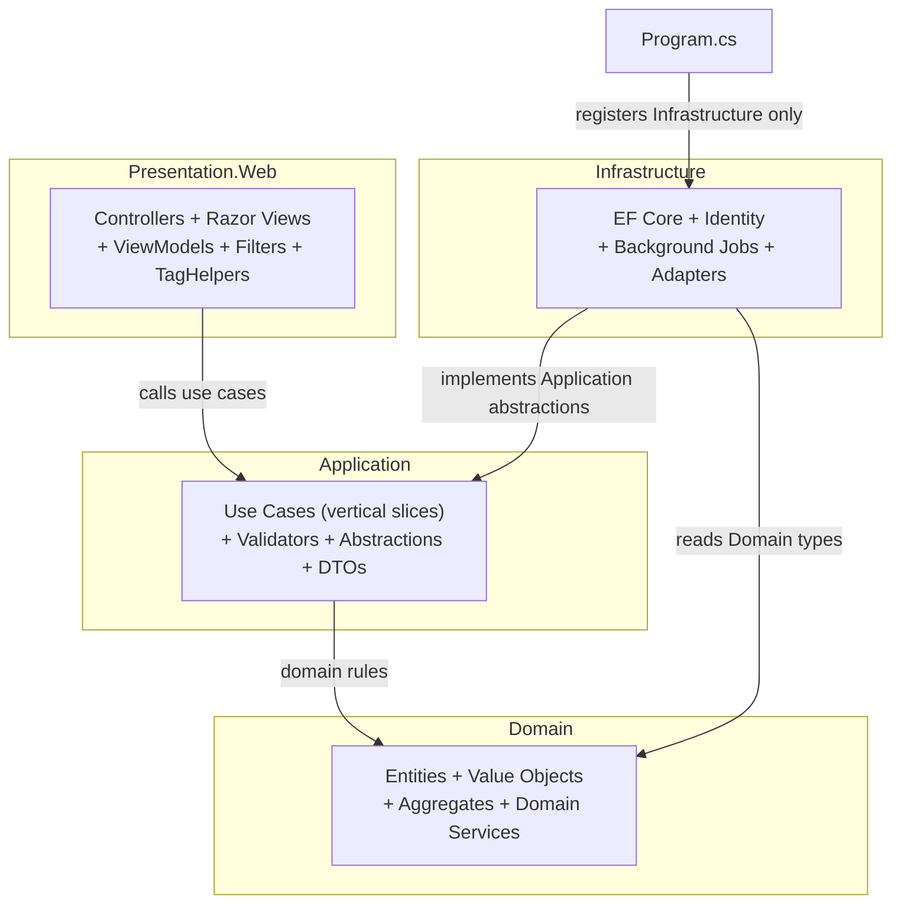

## Clean Architecture — Dependency Diagram

### Permitted Dependencies

| Dependency | Permitted |
|---|---|
| Presentation → Application | ✅ |
| Application → Domain | ✅ |
| Infrastructure → Application abstractions | ✅ |
| Infrastructure → Domain | ✅ (read Domain types only) |
| Program.cs → Infrastructure registration | ✅ (composition root only) |

### Prohibited Dependencies

| Dependency | Violation |
|---|---|
| Domain → Application | ❌ PROHIBITED |
| Domain → Infrastructure | ❌ PROHIBITED |
| Domain → Presentation | ❌ PROHIBITED |
| Application → Infrastructure implementations | ❌ PROHIBITED — Application depends only on its own abstractions |
| Controller → DbContext | ❌ PROHIBITED |
| Controller → concrete repository | ❌ PROHIBITED |
| Razor View → Domain entity | ❌ PROHIBITED |
| Razor View → EF entity | ❌ PROHIBITED |
| Razor View → business rules | ❌ PROHIBITED |

### Dependency Compliance

**No implementation exists yet; dependency compliance cannot be verified against source code.**

When implementation begins, every pull request must demonstrate compliance with the above rules. Any violation must be listed in `plan.md` under the Complexity Tracking section with justification.

### Correction from Conjunto 1

The original Conjunto 1 diagram showed `Application -->|depends on| Infrastructure` which violates Clean Architecture (Application must not reference Infrastructure implementations). This has been corrected: Infrastructure implements Application abstractions, not the reverse.
