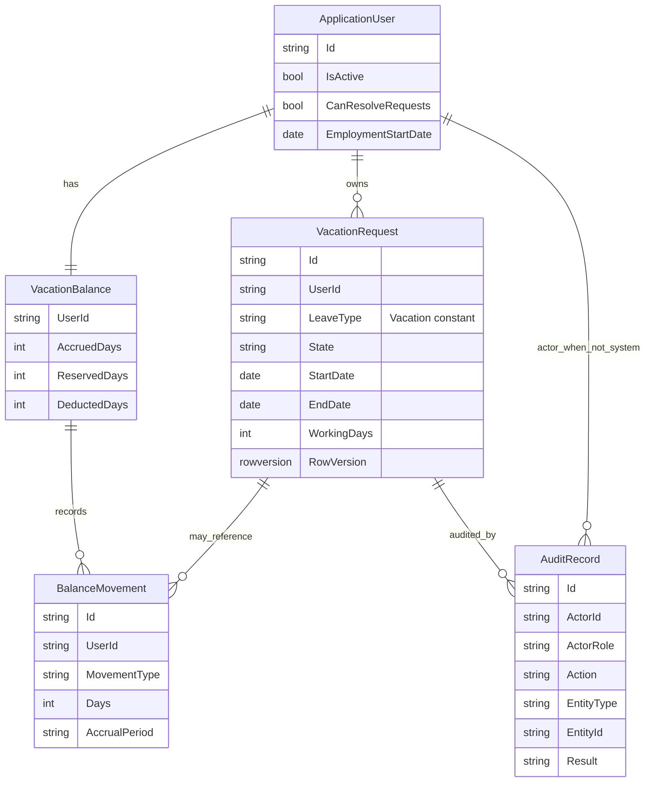

# Core Data Relationships

```mermaid
erDiagram
    ApplicationUser ||--|| VacationBalance : has
    ApplicationUser ||--o{ VacationRequest : owns
    VacationBalance ||--o{ BalanceMovement : records
    VacationRequest ||--o{ BalanceMovement : may_reference
    VacationRequest ||--o{ AuditRecord : audited_by
    ApplicationUser ||--o{ AuditRecord : actor_when_not_system

    ApplicationUser {
      string Id
      bool IsActive
      bool CanResolveRequests
      date EmploymentStartDate
    }

    VacationRequest {
      string Id
      string UserId
      string LeaveType "Vacation constant"
      string State
      date StartDate
      date EndDate
      int WorkingDays
      rowversion RowVersion
    }

    VacationBalance {
      string UserId
      int AccruedDays
      int ReservedDays
      int DeductedDays
    }

    BalanceMovement {
      string Id
      string UserId
      string MovementType
      int Days
      string AccrualPeriod
    }

    AuditRecord {
      string Id
      string ActorId
      string ActorRole
      string Action
      string EntityType
      string EntityId
      string Result
    }
```

`Vacation` is a Domain enum or constant, not a persisted lookup table.
