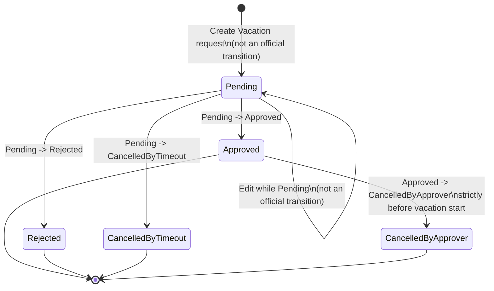

# Request Lifecycle

```mermaid
stateDiagram-v2
    [*] --> Pending: Create Vacation request\n(not an official transition)
    Pending --> Pending: Edit while Pending\n(not an official transition)
    Pending --> Approved: Pending -> Approved
    Pending --> Rejected: Pending -> Rejected
    Pending --> CancelledByTimeout: Pending -> CancelledByTimeout
    Approved --> CancelledByApprover: Approved -> CancelledByApprover\nstrictly before vacation start
    Approved --> [*]
    Rejected --> [*]
    CancelledByTimeout --> [*]
    CancelledByApprover --> [*]
```

The MVP has exactly five states and exactly four official transitions.
