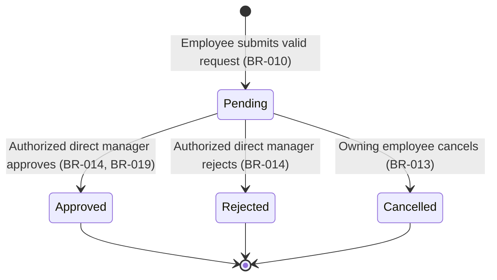

# Feature Specification: NovaLeave MVP — Leave and Vacation Request Management

**Feature Branch**: `001-leave-management-mvp`

**Created**: 2026-07-15

**Status**: Draft

**Input**: User description: "Create the functional specification for the NovaLeave MVP, a leave and vacation request management system, covering Employee, Direct Manager, and Human Resources actors, using EARS-syntax requirements, per the constitution at `.specify/memory/constitution.md`."

**Governance**: This specification is subordinate to `.specify/memory/constitution.md` (currently v3.0.0). It does not repeat the constitution's content; it references specific constitutional sections where a requirement is derived from or constrained by them. No conflict was identified between this request and the current constitution (see [Constitution Check](#constitution-check)).

---

## Purpose and Business Value

NovaLeave MVP gives an organization a single, auditable system of record for employee leave and vacation requests. It replaces ad hoc, unverifiable approval channels (email, chat, spreadsheets) with a workflow that:

- lets employees request time off and track its status and remaining balance without asking HR or their manager directly;
- lets direct managers resolve their team's requests with confidence that approvals are authorized, non-duplicated, and cannot be self-granted;
- gives Human Resources organization-wide visibility for compliance and reporting without HR being able to alter outcomes during the MVP;
- produces an immutable audit trail for every decision, satisfying the constitution's baseline for accountability and dispute resolution (constitution §8, §9.2).

The business value is reduced approval latency, elimination of untraceable manual overrides, and a defensible record for every balance-affecting decision.

## Scope

**In scope for this MVP:**

- Employee submission of a leave/vacation request with start date, end date, leave type, and reason.
- Employee visibility into their own requests, statuses, history, and available balance.
- Employee cancellation of their own Pending requests.
- Direct manager visibility into requests from employees currently on their team.
- Direct manager approval or rejection of Pending requests from their team.
- Human Resources read-only visibility into organization-wide request history and balances.
- Server-side enforcement of dates, balance, overlap, authorization, state transitions, and auditing described in this document.

**Out of scope for this MVP:** see [Out-of-Scope Items](#out-of-scope-items).

## Actors and Authorization Boundaries

| Actor | Can do | Cannot do |
|---|---|---|
| **Employee** | Submit a request; view own requests, statuses, history, and balance; cancel own Pending request | View or act on another employee's requests or balance; approve/reject any request (including their own); edit a resolved request |
| **Direct Manager** | View requests from employees currently assigned to their team; approve or reject Pending requests from their team | View or act on requests from employees not currently on their team; approve or reject their own request; act as HR |
| **Human Resources** | View organization-wide request history and balances (read-only) | Create, approve, reject, cancel, or adjust any request or balance |

A user MAY hold more than one role (constitution §4.4). Authorization is evaluated per action and per resource for the role being exercised; holding the Direct Manager role does not lift the restrictions that apply when the same person acts as an Employee (e.g., they still cannot approve their own request, and they still cannot view another employee's data outside their team).

Team assignment is evaluated at the time of each operation, not at the time the request was submitted (constitution §4.2, §5 invariant 12).

## Assumptions

Reasonable defaults adopted where the request did not specify a value, so that the rest of the specification does not depend on an unapproved policy:

- **A-001 — Overlap definition**: Two requests for the same employee overlap when their date ranges intersect. Overlap is evaluated only against that employee's own requests currently in `Pending` or `Approved` state; `Rejected` and `Cancelled` requests are excluded from the overlap check. This is a working definition for overlap *detection mechanics*; it does not resolve whether the organization permits more than one concurrently Pending request (see [Open Questions](#open-questions), OQ-005).
- **A-002 — Submission-time balance check**: For a leave type that consumes balance, the system performs an informational, server-calculated balance check at submission time and rejects a request that already exceeds the employee's available balance, in addition to the mandatory authoritative revalidation immediately before approval (BR-021). This avoids creating Pending requests that could never be validly approved, while preserving the constitutional rule that deduction itself only happens on approval (constitution §5 invariant 10).
- **A-003 — Leave type catalog exists**: A leave type is selected from a predefined, organization-approved catalog; the request must reference a valid, active leave type. The catalog's specific values and which of them consume balance are not defined by this specification (see OQ-003, OQ-004).
- **A-004 — HR use cases are explicit**: HR's read-only access is delivered through explicitly authorized query use cases (constitution §4.3); HR does not receive incidental write capability through any shared screen or action.
- **A-005 — Single authorized manager per request**: At the moment a request is evaluated, exactly one Direct Manager is authorized to act on it — the manager of the team the requesting employee is currently assigned to. Reassignment mid-request-lifecycle is addressed only as an open question (OQ-008), not resolved here.

## Dependencies

- An existing identity/authentication mechanism that reliably establishes the authenticated actor and their role(s) (constitution §7.1); this specification assumes such a mechanism is in place and does not define it.
- An existing or concurrently defined data source for organizational structure (employee-to-team and team-to-manager assignment) that this feature can query as the source of truth for "currently assigned to their team."
- An existing or concurrently defined leave-type catalog and balance ledger per employee, sufficient to support server-side balance calculation (constitution §5 invariant 13).
- The employee's applicable time zone, to evaluate "past date" and calendar-day boundaries (constitution §5 invariant 4).

## User Scenarios & Testing *(mandatory)*

### User Story 1 - Employee submits and tracks a leave request (Priority: P1)

An employee wants to request time off, and later check whether it was approved, without contacting their manager or HR directly.

**Why this priority**: This is the entry point of the entire workflow; no other actor has anything to review or approve without it. It is also the highest-value replacement for the current untracked, ad hoc process.

**Independent Test**: Can be fully tested by having an authenticated employee submit a request with a valid date range, leave type, and reason, and then view it in their own request list with status `Pending` and see it reflected against their balance.

**Acceptance Scenarios**:

1. **Given** an authenticated employee with sufficient balance, **When** they submit a request with a valid start date, end date, leave type, and reason, **Then** the system creates the request with status `Pending` and it appears in the employee's own history. *(FR-001, FR-002, BR-010)*
2. **Given** an authenticated employee, **When** they view their own request history, **Then** they see only their own requests, statuses, and current available balance. *(FR-003, FR-004, AUTHZ-001)*

---

### User Story 2 - Direct manager reviews and resolves team requests (Priority: P1)

A direct manager wants to see the Pending requests from their current team and approve or reject each one, with confidence that the decision is final, authorized, and recorded.

**Why this priority**: Without manager resolution, no request can leave the `Pending` state and the workflow delivers no business value beyond a request log.

**Independent Test**: Can be fully tested by having an authenticated manager, whose team includes the requesting employee, view a Pending request and approve or reject it, then confirm the resulting state, balance effect (for approval), and audit record.

**Acceptance Scenarios**:

1. **Given** a Pending request from an employee currently on the manager's team, **When** the manager approves it, **Then** the system transitions the request to `Approved`, deducts the applicable balance, and creates an audit record atomically. *(BR-014, BR-019, BR-020, AUD-001)*
2. **Given** a Pending request from an employee currently on the manager's team, **When** the manager rejects it, **Then** the system transitions the request to `Rejected`, does not change the balance, and creates an audit record. *(BR-014, BR-020)*
3. **Given** a Pending request from an employee **not** currently on the manager's team, **When** the manager attempts to view or resolve it, **Then** the system denies the operation. *(AUTHZ-002, SEC-005)*
4. **Given** a Pending request owned by the manager themself, **When** the manager attempts to approve or reject it, **Then** the system rejects the operation. *(BR-008, SEC-007)*

---

### User Story 3 - Employee cancels a pending request (Priority: P2)

An employee who submitted a request wants to withdraw it before their manager acts on it.

**Why this priority**: Necessary for a usable workflow (plans change), but the system delivers its core value (request → decision → audit) without it, so it ranks below submission and resolution.

**Independent Test**: Can be fully tested by having the owning employee cancel their own Pending request and confirming its status becomes `Cancelled` with no balance impact.

**Acceptance Scenarios**:

1. **Given** a Pending request owned by the employee, **When** the employee cancels it, **Then** the system transitions it to `Cancelled`, leaves the balance unaffected, and creates an audit record. *(BR-013, BR-020)*
2. **Given** a request already in a final state (`Approved`, `Rejected`, or `Cancelled`), **When** the owning employee attempts to cancel it, **Then** the system rejects the operation and the state remains unchanged. *(BR-012, BR-015)*

---

### User Story 4 - Human Resources reviews organization-wide data (Priority: P3)

An HR user wants to see every employee's request history and current balance across the organization for compliance and reporting, without being able to alter any of it.

**Why this priority**: Valuable for oversight and reporting, but the workflow between employee and manager functions correctly without it; it is a read-only oversight capability layered on top of the core transactional flow.

**Independent Test**: Can be fully tested by having an authenticated HR user retrieve organization-wide request history and balances, and confirming that no create, approve, reject, cancel, or adjust action is available or effective for that role.

**Acceptance Scenarios**:

1. **Given** an authenticated HR user, **When** they view organization-wide request history and balances, **Then** the system returns data across all employees regardless of team. *(FR-009, FR-010, AUTHZ-003)*
2. **Given** an authenticated HR user, **When** they attempt any create, approve, reject, cancel, or adjust operation, **Then** the system rejects the operation. *(FR-011, BR-009)*

---

### Edge Cases

- What happens when an employee submits a request with a start date later than its end date? → rejected, not created (BR-001).
- What happens when an employee submits a request for a date in the past? → rejected as outside the normal workflow (BR-002, BR-003).
- What happens when a submitted request would exceed the employee's available balance for a balance-consuming leave type? → rejected at submission (A-002) and, independently, re-checked and rejected at approval time if it would still make the balance negative (BR-017, BR-021).
- What happens when a new request's dates overlap an existing Pending or Approved request from the same employee? → rejected (BR-016, A-001).
- How does the system handle a manager who is no longer assigned to the employee's team by the time they attempt to approve a request they could previously see? → the operation is denied; team assignment is revalidated at the moment of the action, not at the moment the list was rendered (BR-021, AUTHZ-005).
- How does the system handle two approval attempts submitted for the same Pending request at nearly the same time (double-click, duplicate network retry, two browser tabs)? → exactly one transition and one balance deduction occur; the losing attempt fails without side effects (CON-001, BR-022).
- How does the system handle an attempt to cancel, approve, or reject a request that is already in a final state? → rejected; the state does not change (BR-012, BR-015).
- How does the system handle an employee who tries to view or cancel a request ID that belongs to a different employee? → denied, and the response does not confirm or deny that the request exists (AUTHZ-001, SEC-006).
- How does the system handle a manager who tries to approve their own request by directly invoking the approval operation (bypassing any hidden UI control)? → rejected regardless of entry point, because authorization is enforced server-side, not through UI visibility (BR-008, SEC-007).
- How does the system handle an anonymous (unauthenticated) actor attempting any of the above operations? → denied without revealing resource existence (SEC-001).
- What happens when a leave request's reason field is viewed by an actor other than the owner, the owning employee's authorized direct manager, or HR? → not shown; sensitive content is restricted to those explicitly authorized actors (BR-023).

## Requirements *(mandatory)*

### Functional Requirements

- **FR-001**: The system shall allow an authenticated employee to submit a leave or vacation request.
- **FR-002**: When an employee submits a leave request, the system shall require a start date, an end date, a leave type, and a reason.
- **FR-003**: The system shall allow an authenticated employee to view their own leave requests, including current status and history.
- **FR-004**: The system shall allow an authenticated employee to view their own available leave balance.
- **FR-005**: While a leave request is `Pending`, the system shall allow its owning employee to cancel it.
- **FR-006**: The system shall allow an authenticated direct manager to view leave requests submitted by employees currently assigned to their team.
- **FR-007**: While a leave request is `Pending`, the system shall allow the request's authorized direct manager to approve it.
- **FR-008**: While a leave request is `Pending`, the system shall allow the request's authorized direct manager to reject it.
- **FR-009**: The system shall allow an authenticated Human Resources user to view organization-wide leave request history.
- **FR-010**: The system shall allow an authenticated Human Resources user to view organization-wide leave balances.
- **FR-011**: If a Human Resources user attempts to create, approve, reject, cancel, or adjust a leave request or balance, then the system shall reject the operation.

### Key Entities

- **Leave Request**: An employee's request for time off. Attributes: owning employee, start date, end date, leave type, reason, status, requested-day total (server-calculated), timestamps. Belongs to exactly one employee; resolved by at most one direct manager.
- **Leave Balance**: An employee's available leave, tracked per applicable leave type. Modified only by an approved, balance-consuming request (deduction) or by a mechanism outside this MVP's scope (accrual — see [Open Questions](#open-questions)).
- **Employee**: A person who can submit requests and has a leave balance. Currently assigned to exactly one team for authorization purposes.
- **Direct Manager**: A role held by a person with respect to a team; authorized to resolve requests only from employees currently on that team.
- **Human Resources User**: A role with organization-wide, read-only visibility.
- **Audit Record**: An immutable record of a state transition or other critical action, created for every transition (see [Audit and Observability Requirements](#audit-and-observability-requirements)).

## Business Rules and Domain Invariants

These correspond directly to the constitutional invariants in §5 and are restated here as testable, numbered requirements scoped to this feature.

- **BR-001**: If a submitted leave request's start date is later than its end date, then the system shall reject the request and shall not create it.
- **BR-002**: If a submitted leave request's start date or end date is earlier than the current date under the applicable date policy, then the system shall reject the request as outside the normal workflow.
- **BR-003**: The system shall determine "current date" and "past date" for date validation using the employee's applicable local date and time-zone policy.
- **BR-004**: The system shall calculate the requested number of leave days on the server according to the approved leave calculation policy.
- **BR-005**: If a leave request submission or a state-changing operation includes a client-supplied requested-day total or balance value, then the system shall disregard that value and use only the server-calculated value.
- **BR-006**: If an employee attempts to view or act on another employee's leave requests or balance, then the system shall deny the operation.
- **BR-007**: The system shall allow a direct manager to view or act on a leave request only when the request belongs to an employee currently assigned to that manager's team.
- **BR-008**: If a direct manager attempts to approve or reject a leave request they own, then the system shall reject the operation.
- **BR-009**: While the MVP is in effect, the system shall restrict Human Resources users to read-only access to leave requests and balances.
- **BR-010**: When an employee submits a valid leave request, the system shall create the request with a `Pending` status.
- **BR-011**: While a leave request is `Pending`, the system shall allow it to transition only to `Approved`, `Rejected`, or `Cancelled`.
- **BR-012**: The system shall treat `Approved`, `Rejected`, and `Cancelled` as final states during the MVP and shall not allow any further transition out of them.
- **BR-013**: While a leave request is `Pending`, the system shall allow only its owning employee to cancel it.
- **BR-014**: While a leave request is `Pending`, the system shall allow only its authorized direct manager to approve or reject it.
- **BR-015**: If an attempt is made to edit a resolved leave request, or to return it to `Pending`, then the system shall reject the operation.
- **BR-016**: If a submitted or evaluated leave request overlaps an existing `Pending` or `Approved` request for the same employee, then the system shall reject the operation.
- **BR-017**: The system shall never allow an employee's applicable leave balance to become negative.
- **BR-018**: The system shall deduct balance only when approving a request whose leave type consumes balance.
- **BR-019**: While a leave request is `Pending`, when its authorized direct manager approves it, the system shall transition the request to `Approved` and apply the corresponding balance deduction atomically.
- **BR-020**: When a leave request state transition occurs, the system shall create an audit record.
- **BR-021**: Immediately before executing a state-changing operation on a leave request, the system shall revalidate identity, ownership, the manager-employee relationship, the request's current state, and the applicable balance.
- **BR-022**: If concurrent or duplicate approval attempts occur on the same leave request, then the system shall apply the resulting balance deduction at most once.
- **BR-023**: The system shall restrict visibility of a leave request's reason to the request's owner, its authorized direct manager, and Human Resources through approved use cases.
- **BR-024**: The system shall not include a leave request's reason, or other unnecessary sensitive data, in logs, traces, metrics, or user-facing technical error messages.
- **BR-025**: If a submitted leave request is for a balance-consuming leave type and its server-calculated requested days exceed the employee's available balance at submission time, then the system shall reject the request.

## Request States and Permitted Transitions

`Approved`, `Rejected`, and `Cancelled` are final states for the MVP; no transition out of them is permitted (BR-012, BR-015). Any transition not shown above is invalid and must be rejected (SEC-011).

## Validation Requirements

- **VAL-001**: If a leave request submission omits the start date, end date, or leave type, then the system shall reject the request and shall not create it.
- **VAL-002**: The system shall validate the submitted leave type against the organization's approved leave-type catalog (A-003).
- **VAL-003**: If a submitted leave type is not present or not active in the approved catalog, then the system shall reject the request.
- **VAL-004**: The system shall treat all date, leave-type, balance, and requested-day values supplied by the client as untrusted input requiring server-side validation before use (constitution §7.1, §7.2).

## Authorization and Resource-Ownership Requirements

- **AUTHZ-001**: The system shall allow an employee to view only leave requests and balance records that they own.
- **AUTHZ-002**: The system shall allow a direct manager to view and resolve only leave requests belonging to employees currently assigned to their team at the time of the operation.
- **AUTHZ-003**: The system shall allow Human Resources users to view leave request history and balances across the organization in read-only mode.
- **AUTHZ-004**: The system shall deny, by default, any action for which the actor's role, ownership, or manager-employee relationship has not been explicitly authorized.
- **AUTHZ-005**: The system shall determine a manager's team-assignment authorization at the time of each operation, not from a previously cached or client-supplied relationship.

## Security and Privacy Requirements

Aligned to the constitution's OWASP Top 10:2025 baseline: A01 Broken Access Control, A06 Insecure Design, A09 Security Logging and Alerting Failures (constitution §9, §7.4).

- **SEC-001**: If an unauthenticated actor attempts to access any leave request, balance, or approval function, then the system shall deny the operation without revealing whether the targeted resource exists.
- **SEC-002**: If an actor presents invalid or expired authentication, then the system shall deny access to any protected leave-management function and require re-authentication.
- **SEC-003**: If an authenticated actor's role does not permit the requested action, then the system shall deny the operation.
- **SEC-004**: If an employee attempts to view or modify a leave request or balance belonging to another employee, then the system shall deny the operation.
- **SEC-005**: If a manager attempts to view or act on a leave request belonging to an employee not currently assigned to their team, then the system shall deny the operation.
- **SEC-006**: If an actor supplies or manipulates a request or resource identifier to attempt access to a leave request or balance they are not authorized to view, then the system shall deny the operation and shall not reveal the existence of the targeted resource to that actor.
- **SEC-007**: If a manager attempts to approve or reject a leave request they own, then the system shall reject the operation.
- **SEC-008**: If an actor attempts an action requiring a role or privilege beyond their assigned role, then the system shall deny the operation and shall not elevate the actor's effective privileges.
- **SEC-009**: If an employee submits a leave request that duplicates an existing `Pending` or `Approved` request for the same employee, same leave type, and overlapping dates, then the system shall reject the duplicate.
- **SEC-010**: If a state-changing operation is replayed or resubmitted after it has already been applied, then the system shall not apply it a second time and shall return a result reflecting the request's current, already-resolved state.
- **SEC-011**: If an actor attempts a state transition not permitted for the leave request's current state, then the system shall reject the transition and leave the request's state unchanged.
- **SEC-012**: The system shall redact a leave request's reason and other unnecessary sensitive data from logs, traces, metrics, and user-facing technical error messages.
- **SEC-013**: The system shall record a security-relevant event for each of the following: successful authentication, failed authentication, access denial, request creation, approval, rejection, cancellation, and invalid-transition attempt.
- **SEC-014**: If a security-relevant anomaly occurs — including repeated authentication failures, repeated access denials, or a suspected unauthorized resource-access attempt — then the system shall generate an event suitable for alerting.

## Audit and Observability Requirements

- **AUD-001**: When a leave request state transition occurs, the system shall create an audit record containing at minimum: timestamp, actor identifier, actor role, action, entity type, entity identifier, and result (constitution §8).
- **AUD-002**: Where an audit record captures before/after values, the system shall redact sensitive fields, including the full reason, from that record.
- **AUD-003**: The system shall protect audit records against unauthorized modification or deletion.
- **AUD-004**: The system shall not physically delete leave requests or audit records through normal application operations.

## Concurrency and Duplicate-Operation Requirements

- **CON-001**: While a leave request is `Pending`, if two or more approval or rejection attempts occur concurrently, then the system shall apply exactly one resulting state transition and shall cause any other conflicting attempt to fail without applying an additional balance deduction.
- **CON-002**: The system shall verify overlap atomically with the operation that confirms (approves) a request, such that two concurrently approved requests for the same employee cannot both be confirmed if they would overlap.
- **CON-003**: If a state-changing operation is attempted against a leave request whose state or balance has changed since it was last read by the requesting actor, then the system shall detect the conflict and reject the operation rather than apply it against stale data.

## Error and Failure Behavior

- **ERR-001**: If a leave request submission fails validation, then the system shall reject the request, shall not create it, and shall communicate which validation rule failed without exposing sensitive or internal technical detail.
- **ERR-002**: If an approval, rejection, or cancellation operation cannot complete due to a system or data error, then the system shall leave the leave request and balance unchanged and shall not partially apply the operation.
- **ERR-003**: If a user-facing error occurs, then the system shall present a message that does not disclose sensitive leave data, internal implementation details, or stack traces.

## Acceptance Scenarios

Each scenario references the requirement identifier(s) it validates.

1. **Submitting a valid request** — **Given** an authenticated employee with sufficient balance and no overlapping requests, **When** they submit a request with valid dates, leave type, and reason, **Then** the system creates it as `Pending`. *(FR-001, FR-002, BR-010)*
2. **Submitting a request with invalid dates** — **Given** an authenticated employee, **When** they submit a request whose start date is later than its end date, **Then** the system rejects it and does not create it. *(BR-001, ERR-001)*
3. **Submitting a request for a past date** — **Given** an authenticated employee, **When** they submit a request whose start date is before the current date in their local time zone, **Then** the system rejects it. *(BR-002, BR-003)*
4. **Submitting a request with insufficient balance** — **Given** an authenticated employee whose available balance is less than the requested days for a balance-consuming leave type, **When** they submit the request, **Then** the system rejects it. *(BR-025, BR-017)*
5. **Detecting an overlapping request** — **Given** an authenticated employee with an existing `Pending` request for a date range, **When** they submit a new request whose dates intersect that range, **Then** the system rejects the new request. *(BR-016)*
6. **Viewing one's own request history** — **Given** an authenticated employee with prior requests, **When** they view their history, **Then** they see only their own requests and current balance. *(FR-003, FR-004, AUTHZ-001)*
7. **Attempting to view another employee's data** — **Given** an authenticated employee, **When** they attempt to view another employee's requests or balance, **Then** the system denies the operation without confirming the target's existence. *(BR-006, SEC-004, SEC-006)*
8. **Manager viewing their team's pending requests** — **Given** an authenticated manager whose team includes the requesting employee, **When** the manager views pending requests, **Then** the system returns only requests from employees currently on that team. *(FR-006, AUTHZ-002)*
9. **Manager attempting to access another team's request** — **Given** an authenticated manager, **When** they attempt to view or resolve a request from an employee not currently on their team, **Then** the system denies the operation. *(BR-007, SEC-005)*
10. **Approving a pending request** — **Given** a `Pending` request from an employee on the manager's team, **When** the manager approves it, **Then** the system transitions it to `Approved`, deducts balance, and creates an audit record, all atomically. *(BR-014, BR-019, BR-020, AUD-001)*
11. **Rejecting a pending request** — **Given** a `Pending` request from an employee on the manager's team, **When** the manager rejects it, **Then** the system transitions it to `Rejected` without balance impact and creates an audit record. *(BR-014, BR-020)*
12. **Attempting self-approval** — **Given** a `Pending` request owned by the manager, **When** the manager attempts to approve or reject it, **Then** the system rejects the operation. *(BR-008, SEC-007)*
13. **Cancelling a pending request** — **Given** a `Pending` request owned by the employee, **When** the employee cancels it, **Then** the system transitions it to `Cancelled` without balance impact and creates an audit record. *(BR-013, BR-020)*
14. **Attempting to cancel a resolved request** — **Given** a request already in `Approved`, `Rejected`, or `Cancelled` state, **When** the owning employee attempts to cancel it, **Then** the system rejects the operation and the state is unchanged. *(BR-012, BR-015)*
15. **Two simultaneous approval attempts** — **Given** a `Pending` request, **When** two approval attempts are submitted concurrently, **Then** exactly one succeeds, exactly one balance deduction is applied, and the other attempt fails without side effects. *(CON-001, BR-022)*
16. **Audit-record creation** — **Given** any successful state transition, **When** the transition completes, **Then** an audit record exists containing timestamp, actor identifier, actor role, action, entity type, entity identifier, and result. *(AUD-001, BR-020)*
17. **Sensitive-data redaction** — **Given** a leave request with a reason containing personal information, **When** the system writes a log, trace, metric, or user-facing error related to that request, **Then** the reason does not appear in it. *(BR-024, SEC-012, AUD-002)*

## Out-of-Scope Items

The following are explicitly not part of this MVP and are not addressed by the requirements above:

- Balance accrual, expiration, and carryover mechanics (see OQ-006).
- Manager delegation or reassignment workflows (see OQ-007, OQ-008).
- Retroactive adjustments or corrections to resolved requests (see OQ-009).
- Payroll integration or any payroll-impacting behavior (see OQ-010).
- Half-day, hourly, or partial-day requests (see OQ-002).
- Any HR write capability (creation, approval, rejection, cancellation, or balance adjustment) — HR is read-only for the entire MVP (constitution §4.3).
- Notifications, calendars, external identity providers beyond the existing authentication dependency, multi-company support, and any public API surface (constitution §17) — none of these are current defaults and each would require its own approved specification and ADR.
- Reporting/analytics beyond the read-only history and balance views described here.

## Open Questions

The following policy questions are **not resolved** by this specification, are not assumed by any requirement above, and must be answered by an approved source (an amendment to this spec, a separate approved specification, or a constitutional amendment) before a dependent implementation decision is made:

- **OQ-001**: Is the requested-day count based on calendar days or working days?
- **OQ-002**: How do weekends and holidays affect the requested-day calculation, and are half-day or hourly requests supported?
- **OQ-003**: Which leave types exist, and which of them consume balance?
- **OQ-004**: Does medical leave consume balance, and does it have distinct rules from other leave types?
- **OQ-005**: Is an employee permitted to have more than one `Pending` request at the same time (independent of whether their dates overlap)?
- **OQ-006**: What are the balance accrual, expiration, and carryover rules?
- **OQ-007**: What happens to a `Pending` request if the employee's direct manager changes before it is resolved?
- **OQ-008**: Is manager delegation or temporary reassignment supported, and if so, under what authorization model?
- **OQ-009**: Are retroactive adjustments to resolved requests or balances permitted, and if so, through what controlled, audited process (constitution §4.3 anticipates this requires an independent specification)?
- **OQ-010**: What, if anything, does an approved/rejected/cancelled request need to communicate to payroll, and through what mechanism?

No requirement in this specification presumes an answer to any of the above; where a rule depends on one of these questions (e.g., BR-004's "approved leave calculation policy," BR-018's "leave type consumes balance"), the rule is written to be parameterized by the eventual answer rather than to assume one.

## Success Criteria *(mandatory)*

### Measurable Outcomes

- **SC-001**: An employee can submit a valid leave request and see it appear in their own history with status `Pending` in the same session, with zero manual (human) intervention required to record it.
- **SC-002**: 100% of state transitions (`Pending → Approved`, `Pending → Rejected`, `Pending → Cancelled`) produce exactly one corresponding audit record, verifiable by an independent query against the audit trail.
- **SC-003**: 0 instances of an employee's balance becoming negative, verifiable across all approved requests at any point in time.
- **SC-004**: 0 instances, under concurrent or duplicate approval attempts on the same request, of more than one balance deduction being applied for that request.
- **SC-005**: 100% of cross-employee and cross-team access attempts in acceptance testing are denied, with 0 instances of an unauthorized actor's request returning another actor's data.
- **SC-006**: 100% of self-approval attempts by a direct manager on their own request are rejected in acceptance testing.
- **SC-007**: 0 instances, in acceptance testing or log review, of a leave request's reason appearing in logs, traces, metrics, or user-facing technical error output.
- **SC-008**: A direct manager can retrieve their team's Pending requests and resolve one (approve or reject) without needing to consult any actor or system outside NovaLeave.
- **SC-009**: An HR user can retrieve organization-wide request history and balances, with 0 available write actions (create, approve, reject, cancel, adjust) surfaced or effective for that role.

## Constitution Check

This specification was authored against `.specify/memory/constitution.md` v3.0.0 and complies as follows:

| Constitutional area | How this specification complies |
|---|---|
| §4.1–§4.3 Actors and Authorization | Actor capabilities and boundaries (Employee, Direct Manager, HR read-only) match §4.1–§4.3 exactly; no additional or reduced capability was introduced. |
| §4.4 Multiple roles | Reflected in [Actors and Authorization Boundaries](#actors-and-authorization-boundaries): authorization is evaluated per action/resource, not per user. |
| §5 Invariants and Lifecycle | Every numbered invariant in §5 (items 1–13) has a corresponding BR-xxx requirement in [Business Rules and Domain Invariants](#business-rules-and-domain-invariants); none was reduced, and none was strengthened beyond what §5 states. |
| §5.1 Rules that belong in feature specifications | Every item in the §5.1 list is captured verbatim as an [Open Questions](#open-questions) entry (OQ-001–OQ-010) and no requirement in this spec assumes an answer to any of them, per §5.1's explicit prohibition. |
| §7.3 Sensitive Data | BR-023, BR-024, SEC-012, AUD-002 restrict the reason field to owner/manager/HR and require redaction from logs, traces, metrics, and diagrams. |
| §7.4 / §9 OWASP baseline (A01, A06, A09) | [Security and Privacy Requirements](#security-and-privacy-requirements) explicitly covers anonymous access, invalid/expired auth, incorrect roles, cross-employee access, cross-team access, IDOR, self-approval, privilege escalation, duplicate submissions, replay, invalid transitions, redaction, and required audit/security events — matching the constitution's mandated test coverage list in §7.4. |
| §8 Auditing | AUD-001–AUD-004 mirror the minimum audit record fields and immutability requirements of §8. |
| §6 Concurrency | CON-001–CON-003 restate the optimistic-concurrency and atomic-overlap-verification requirements of §6 at the specification level, without prescribing a specific mechanism (e.g., rowversion), which remains an implementation decision for the plan phase. |
| Implementation independence | No controller, repository, database table, framework, class, endpoint, or code structure is prescribed anywhere in this document, consistent with the request and with the constitution reserving those decisions for the plan and code (§1, §3). |
| Scope discipline | [Out-of-Scope Items](#out-of-scope-items) explicitly excludes notifications, calendars, external IdP changes, multi-company support, and public APIs, matching §17's list of non-default future evolutions. |

**No conflicts were identified** between this feature request and the current constitution. No deviation or exception is being requested; therefore no §16.3 exception record is required for this specification.
