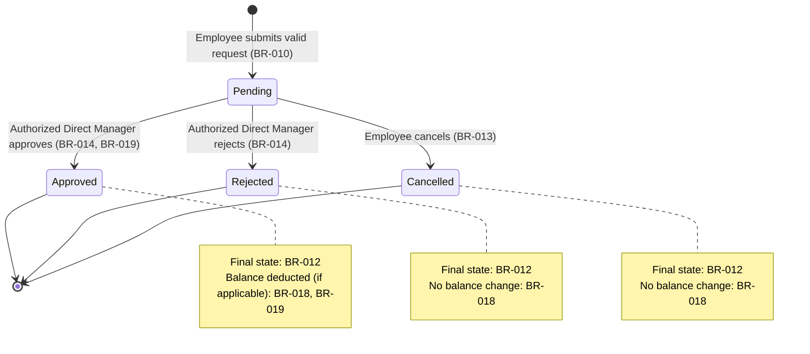

# Feature Specification: NovaLeave MVP — Leave and Vacation Request Management

## 1. Feature Metadata

**Feature Name**: NovaLeave MVP — Leave and Vacation Request Management  
**Feature Branch**: `001-leave-management-mvp`  
**Created**: 2026-07-15  
**Status**: Draft  
**Last Revised**: 2026-07-15  
**Revision Note**: Refactored to improve EARS classification, requirement organization, glossary, traceability, and scope clarity. All approved business behavior, authorization boundaries, domain invariants, and open questions are preserved. Implementation-independent structure enhanced; no intentional change to feature scope.

**Constitution Version**: 3.0.0 (`.specify/memory/constitution.md`)  
**Governance**: This specification is subordinate to the constitution. It does not repeat constitutional content; it references constitutional sections where requirements are derived from or constrained by them. Constitution Check performed after all revisions.

---

## 2. Feature Overview

NovaLeave MVP is an auditable, workflow-driven system of record for managing employee leave and vacation requests. It replaces ad hoc approval channels (email, chat, spreadsheets) with a traceable, server-enforced process that connects Employee submission, Direct Manager approval, and organization-wide HR visibility.

### Key Capabilities

- **Employee-initiated requests**: Employees submit requests for time off, specifying start date, end date, leave type, and reason.
- **Request tracking**: Employees view their own requests, statuses, history, and current available balance.
- **Manager resolution**: Direct Managers view, approve, or reject team requests with authorization and audit guarantees.
- **Employee cancellation**: Employees withdraw Pending requests before manager action.
- **HR visibility**: Human Resources users access organization-wide request history and balances in read-only mode.

---

## 3. Purpose and Business Value

### Business Goals

- **Single system of record**: Establish a single, auditable source of truth for all leave decisions, eliminating ad hoc approval channels and unverifiable communications.
- **Reduced latency**: Enable employees and managers to complete requests and decisions without manual handoff or HR intermediation.
- **Accountability and compliance**: Produce immutable audit trails for every balance-affecting decision and approval, supporting dispute resolution and compliance reporting.
- **Defensible authorization**: Guarantee that only authorized managers approve requests from their team members and prevent self-approval.
- **Data integrity**: Protect the accuracy of balances and prevent overlapping requests that could violate organizational leave policy.

### Business Value

- **Approval efficiency**: Direct Managers resolve their team's requests without external coordination; latency decreases from days (email, chat) to minutes (workflow).
- **Auditability**: Every decision is timestamped, attributed, and immutable; compliance reporting and dispute resolution are supported by evidence.
- **Risk reduction**: Elimination of untraceable manual overrides and self-granting of requests (which may be illegal in some jurisdictions).
- **Process visibility**: Organization gains real-time insight into leave consumption and team availability for planning.

---

## 4. Business Context and Constraints

### Confirmed Constraints

- **Authentication and identity**: An existing authentication mechanism reliably establishes the authenticated actor and their role(s) (constitution §7.1). This specification assumes such a mechanism is in place and does not define it.
- **Organizational structure**: An existing or concurrently defined data source provides employee-to-team and team-to-manager assignment, used as the source of truth for "currently assigned to their team" (constitution §4.2, §5 invariant 12).
- **Leave-type catalog**: An existing or concurrently defined catalog defines available leave types, which ones consume balance, and any type-specific rules (constitution §5.1).
- **Leave balance ledger**: An existing or concurrently defined balance ledger or accrual mechanism supports server-side balance calculation and storage per employee per leave type (constitution §5 invariant 10).
- **Employee time zone**: The employee's primary time zone is available to the system for evaluating "past date" and calendar-day boundaries (constitution §5 invariant 4).
- **Server-authoritative computation**: All balance calculations, overlap checks, date validations, and state transitions MUST be computed server-side; client-supplied values are informational only (constitution §5 invariant 13, §7.1, §9.1).
- **Atomic operations**: Approval, balance deduction, and audit-record creation MUST execute within a single transaction; partial success is not permitted (constitution §6).
- **Optimistic concurrency**: State and balance modifications MUST use concurrency controls (e.g., `rowversion` or equivalent) to detect and handle conflicts (constitution §6).

### Temporary Working Assumptions

- **TA-001 — Overlap definition**:  
  *What it assumes*: Two requests for the same employee overlap when their date ranges intersect. Overlap is evaluated only against that employee's own requests currently in `Pending` or `Approved` state; `Rejected` and `Cancelled` requests are excluded.  
  *Why it is temporarily needed*: To permit the system to reject requests that would violate the organization's leave policy without awaiting approval of a formal overlap-calculation specification.  
  *Tied to open question*: OQ-005 (whether an employee can have multiple concurrent Pending requests regardless of overlap) and OQ-001 (calendar-day vs. working-day rules, which affect overlap calculation).  
  *Does not resolve*: Whether overlapping Pending requests are ever permitted or whether only non-overlapping Approved requests are allowed.

- **TA-002 — Submission-time balance check**:  
  *What it assumes*: For a leave type that consumes balance, the system performs a balance check at submission time and rejects a request that would exceed the employee's available balance.  
  *Why it is temporarily needed*: To avoid creating Pending requests that can never be validly approved, improving user experience and reducing wasted workflow steps.  
  *Tied to open question*: OQ-003 (which leave types consume balance) and OQ-006 (how balance is accrued and whether negative balances are ever recoverable).  
  *Does not resolve*: The constitutional mandate that balance deduction occurs only on approval (constitution §5 invariant 10), not at submission. The submission-time check is informational and does not deduct; mandatory revalidation occurs at approval (BR-021).

- **TA-003 — Leave type is selected**:  
  *What it assumes*: A leave type is selected from a predefined, organization-approved catalog; the system validates that the selected type exists and is active.  
  *Why it is temporarily needed*: To permit request submission to proceed without awaiting a full leave-type specification.  
  *Tied to open question*: OQ-003 (which leave types exist and which consume balance) and OQ-004 (whether medical leave has distinct rules).  
  *Does not resolve*: The specific leave types, accrual rules, or type-specific validation.

---

## 5. Business Glossary

**Approved**: A final request state indicating that the authorized Direct Manager has approved the employee's time off and the balance (if applicable) has been deducted. No further transitions are permitted. See also Request State.

**Audit Record**: An immutable record of a state transition, approval denial, or other critical action, created atomically with the event. Audit records are not accessible for deletion or modification through application operations. See also Audit and Observability Requirements.

**Balance**: The available leave units (days, hours, or equivalent) for an employee in a specific Leave Type. Balance is reduced when an approved request's Leave Type consumes balance; balance is never increased by this system (accrual and carryover are out of scope). See also Leave Balance.

**Balance-Consuming Leave Type**: A Leave Type for which approved requests reduce the employee's available balance for that type. Not all Leave Types consume balance (e.g., unpaid leave, sabbatical). See also Leave Type.

**Cancelled**: A final request state indicating that the employee has withdrawn their Pending request before manager action. No balance effect. No further transitions are permitted. See also Request State.

**Direct Manager**: An organizational role held with respect to a team. The Direct Manager is authorized to view and resolve requests from employees currently assigned to their team at the time of each operation. A user may hold the Direct Manager role for one or more teams. See also Actors and Authorization Boundaries.

**Employee**: An actor in the system who creates leave requests, views their own requests and balance, and can cancel their own Pending requests. An employee is currently assigned to exactly one team for authorization purposes. An employee MAY also hold the Direct Manager or Human Resources role. See also Actors and Authorization Boundaries.

**Human Resources (HR)**: An organizational role with organization-wide read-only access to leave request history and balances. HR cannot create, modify, approve, reject, cancel, or adjust any request or balance. See also Actors and Authorization Boundaries.

**Leave Balance**: The available leave units (days, hours, or equivalent) allocated to an employee for a specific Leave Type. See also Balance.

**Leave Request**: A formal request submitted by an employee for time off, containing a start date, end date, leave type, reason, and initial status of Pending. The request is owned by the submitting employee and is resolved only by an authorized Direct Manager or cancelled by the employee. See also Request Owner.

**Leave Type**: A classification of leave (vacation, sick leave, medical leave, unpaid leave, etc.) selected by the employee when submitting a request. Leave types are drawn from an organization-approved catalog. Each Leave Type may or may not consume balance. See also Balance-Consuming Leave Type.

**Overlapping Request**: A leave request whose date range intersects with another existing request for the same employee in Pending or Approved state. Overlapping requests are rejected per TA-001 and BR-016. See also Requested Days.

**Pending**: The initial request state after successful submission. A Pending request can transition to Approved, Rejected, or Cancelled. See also Request State.

**Rejected**: A final request state indicating that the authorized Direct Manager has denied the employee's request. No balance effect. No further transitions are permitted. See also Request State.

**Request Owner**: The employee who created (submitted) the leave request. Only the Request Owner can cancel their own Pending request; only an authorized Direct Manager can approve or reject it. See also Actors and Authorization Boundaries.

**Request State** (or **Status**): One of five lifecycle states — Pending, Approved, Rejected, Cancelled — representing the current phase of a leave request. State transitions are strictly controlled and only transitions explicitly permitted are valid. See also Request States and Permitted Transitions.

**Requested Days**: The number of leave days (or equivalent units) for which the request is made, calculated server-side according to the leave-day calculation policy. Client-supplied requested-day values are never accepted as truth. See also Business Glossary, Business Rules and Domain Invariants.

**State Transition**: A change in a Leave Request's state from one valid state to another, triggered by an employee action (submission, cancellation) or Direct Manager action (approval, rejection). Every state transition is audited. See also Request States and Permitted Transitions, Audit and Observability Requirements.

**Team Assignment**: The current assignment of an employee to a team for authorization purposes. Team assignment is used to determine which Direct Manager(s) are authorized to view and resolve requests. Team assignment is evaluated at the time of each operation, not cached. See also Direct Manager, Actors and Authorization Boundaries.

---

## 6. Scope

### In Scope for This MVP

The MVP covers the core leave request workflow from submission to final decision:

- **Employee submission**: Authenticated employees can submit requests with start date, end date, leave type, and reason.
- **Employee visibility**: Employees can view their own requests, statuses, history, and current available leave balance.
- **Employee cancellation**: Employees can cancel their own Pending requests.
- **Manager review**: Direct Managers can view Pending requests from employees currently on their team.
- **Manager resolution**: Direct Managers can approve or reject Pending requests from their team.
- **HR oversight**: Human Resources users can view organization-wide request history and balances in read-only mode.
- **Authorization**: Server-side enforcement of actor roles, ownership, team membership, and approved transitions.
- **Date and balance validation**: Server-side enforcement of start date ≤ end date, no past dates, no overlaps, and no negative balances.
- **Atomicity and concurrency**: Approval, balance deduction, and audit record are atomic; concurrent attempts are handled safely.
- **Auditing**: Immutable, detailed audit records for every state transition and critical action.
- **Security**: OWASP A01, A06, A09 baseline controls for authentication, authorization, and audit logging.

---

## 7. Non-Goals

The following broader business and operational problems are **not** the responsibility of this feature and are out of scope:

- **Payroll processing**: NovaLeave records leave decisions but does not calculate payroll, process tax withholding, or create payroll transactions.
- **Workforce scheduling**: NovaLeave does not schedule work, assign tasks, or determine whether team capacity is affected by approved leave.
- **Capacity planning**: Forecasting future leave demand and availability for staffing decisions is outside this feature.
- **Attendance tracking**: NovaLeave records approved leave but does not track actual clock-in/out, presence, or attendance exceptions.
- **Employee performance management**: Leave decisions do not affect performance ratings, promotion eligibility, or disciplinary records.
- **Legal determination of leave entitlement**: NovaLeave does not interpret labor laws, union rules, or employment agreements to determine whether an employee is entitled to specific types or amounts of leave.
- **General HR case management**: NovaLeave does not handle employee disputes, accommodations, investigations, or other HR cases.
- **Automatic manager delegation**: NovaLeave does not automatically reassign pending requests when a manager leaves; reassignment requires manual intervention (see OQ-008).
- **Balance accrual and carryover policy design**: Determining how many days an employee earns each month or year and whether unused days carry over is decided through policy, not by this system.

---

## 8. Out-of-Scope Items

The following are explicitly **not** part of this MVP:

- **Balance accrual, expiration, and carryover** (see OQ-006): NovaLeave consumes balance when a request is approved, but does not implement accrual schedules, expiration rules, or carryover logic.
- **Manager delegation or reassignment workflows** (see OQ-007, OQ-008): If an employee's Direct Manager changes while a request is Pending, the system does not automatically reassign the request or delegate approval authority.
- **Retroactive adjustments or corrections** (see OQ-009): NovaLeave does not permit HR or managers to retroactively modify resolved requests, cancel past Approved requests, or restore balance. Such corrections require an independent specification with dedicated authorization and audit controls.
- **Payroll integration** (see OQ-010): NovaLeave does not communicate leave decisions to payroll or other business systems.
- **Half-day, hourly, or partial-day requests** (see OQ-002): The MVP assumes all requests are full-day. Partial-day support requires a separate specification.
- **HR write capability**: HR is strictly read-only during the MVP (constitution §4.3). Creation, approval, rejection, cancellation, or balance adjustment by HR is not permitted.
- **Notifications and calendars**: Email, SMS, calendar invitations, or in-app notifications are not part of the leave request feature; they may be added separately.
- **External identity providers**: Integration with LDAP, Azure AD, SAML, or other external identity systems is not part of this feature; the constitution specifies the authentication mechanism.
- **Multi-company support**: The system assumes a single organizational context; multi-company or multi-tenant support requires a separate architectural specification.
- **Public API surface**: Web APIs are not approved for external clients or integrations in the MVP. Any API addition requires an approved specification and ADR (constitution §17).
- **Reporting and analytics**: Beyond the read-only history and balance views provided to Employees, Direct Managers, and HR, reporting, dashboards, and analytics are out of scope.

---

## 9. Actors and Authorization Boundaries

### Authorization Matrix

| Actor | Can Submit | Can View Own | Can View Team | Can View Org | Can Approve | Can Reject | Can Cancel | Can Adjust Balance |
|---|:---:|:---:|:---:|:---:|:---:|:---:|:---:|:---:|
| **Employee** | ✓ | ✓ | ✗ | ✗ | ✗ | ✗ | ✓ (own) | ✗ |
| **Direct Manager** | ✓* | ✓ | ✓ | ✗ | ✓ (team) | ✓ (team) | ✓ (own) | ✗ |
| **Human Resources** | ✗ | ✗ | ✗ | ✓ (read-only) | ✗ | ✗ | ✗ | ✗ |

*Direct Managers can submit requests as Employees, but cannot approve/reject their own requests.

### Key Authorization Rules

- **Employee**: Can create requests and manage only their own data. Cannot view, approve, reject, or modify other employees' requests. Cannot edit resolved requests.
- **Direct Manager**: Can view and resolve requests only for employees currently assigned to their team at the time of the operation. Cannot approve/reject their own requests. Cannot act as HR. Team assignment is evaluated at each operation, not cached.
- **Human Resources**: Strictly read-only access to organization-wide data. Cannot create, modify, approve, reject, cancel, or adjust any request or balance (constitution §4.3).
- **Multiple roles**: A user MAY hold more than one role. Authorization is evaluated per action and per resource for the role being exercised. Holding Direct Manager role does not lift Employee-role restrictions (e.g., a manager still cannot approve their own request even if they hold the Employee role).

---

## 10. Dependencies

This feature assumes the following exist or are being developed concurrently:

| Dependency | Why Needed | Provided By |
|---|---|---|
| Authentication and identity system | Establishes the authenticated actor and their assigned role(s). | External system (not defined by this spec); assumed to be in place per constitution §7.1. |
| Organizational structure data source | Provides current employee-to-team and team-to-manager assignment used as the source of truth for "currently assigned to their team." | External system (assumed to exist or be concurrently developed). |
| Leave-type catalog | Lists available leave types and indicates which consume balance. | External system or concurrent specification. Specific types and rules are defined by OQ-003, OQ-004. |
| Leave balance ledger | Stores and permits querying available balance per employee per leave type. Updates balance only when this feature deducts it via approval. | External system or concurrent specification. Accrual rules defined by OQ-006. |
| Employee time zone | Provides each employee's primary time zone for "past date" evaluation and calendar-day boundaries. | External system (assumed available). Required per constitution §5 invariant 4. |

---

## 11. User Stories and Journeys

Each user story describes a business goal for a specific actor. Priorities follow MoSCoW: **Must Have** (required for MVP release), **Should Have** (high value, but MVP functions without it), **Could Have** (nice-to-have, deferrable).

### US-001 — Employee Submits and Tracks a Leave Request

**Priority**: Must Have  
**Primary Actor**: Employee  
**Goal**: An employee requests time off and tracks its status and balance without manual intervention from managers or HR.  
**Business Outcome**: Employees reduce approval latency and gain visibility into request status and available balance in real time, eliminating ad hoc communications.  
**Why This Priority**: This is the entry point of the entire workflow; no approval or audit trail is possible without it. Highest-value replacement for untracked, ad hoc leave processes.  
**Independent Test**: Verify that an authenticated employee with sufficient balance and no overlapping requests can submit a valid request, see it appear in their own history with Pending status, and see the balance impact (informational at submission; actual deduction on approval).  
**Related Acceptance Scenarios**: AC-001, AC-002, AC-003, AC-004, AC-005.  
**Related Requirements**: FR-001, FR-002, FR-003, FR-004, BR-010, BR-025, AUTHZ-001, VAL-001, VAL-002, VAL-003, VAL-004.

---

### US-002 — Direct Manager Reviews and Resolves Team Requests

**Priority**: Must Have  
**Primary Actor**: Direct Manager  
**Goal**: A direct manager views Pending requests from their current team, approves or rejects each one, and receives confirmation of the final state and audit recording.  
**Business Outcome**: Managers resolve requests efficiently with confidence that decisions are authorized, non-duplicated, atomically recorded, and immutable.  
**Why This Priority**: Without manager resolution, no request can leave Pending state and the workflow delivers no business value. Critical to the core transactional flow.  
**Independent Test**: Verify that an authenticated manager whose team includes the requesting employee can view Pending requests from team members, approve or reject a request, and confirm that the resulting state, balance effect (if applicable), and audit record are atomic and correct.  
**Related Acceptance Scenarios**: AC-008, AC-009, AC-010, AC-011, AC-012, AC-015.  
**Related Requirements**: FR-006, FR-007, FR-008, BR-014, BR-019, BR-020, BR-021, BR-022, AUTHZ-002, AUTHZ-005, SEC-005, SEC-007, CON-001, CON-002, AUD-001.

---

### US-003 — Employee Cancels a Pending Request

**Priority**: Should Have  
**Primary Actor**: Employee  
**Goal**: An employee who submitted a request wants to withdraw it before their manager has resolved it.  
**Business Outcome**: Employees retain control over pending requests and can respond to changing circumstances without waiting for manager rejection or requiring manager involvement to withdraw a request.  
**Why This Priority**: Necessary for a complete, usable workflow (circumstances change frequently), but the core submission-and-approval loop functions without it. Ranked below submission and resolution.  
**Independent Test**: Verify that an authenticated employee can cancel their own Pending request, see its status change to Cancelled with no balance impact, and receive confirmation that an audit record was created.  
**Related Acceptance Scenarios**: AC-013, AC-014.  
**Related Requirements**: FR-005, BR-013, BR-020, AUTHZ-001, AUD-001.

---

### US-004 — Human Resources Reviews Organization-Wide Data

**Priority**: Could Have  
**Primary Actor**: Human Resources  
**Goal**: An HR user views every employee's request history and current balance across the organization for compliance reporting and oversight, without being able to alter outcomes.  
**Business Outcome**: HR gains visibility into leave consumption patterns, can generate compliance reports, and can audit decision making.  
**Why This Priority**: Valuable for oversight and reporting, but the workflow between employee and manager is complete without it. A read-only overlay on top of the core transactional flow. Often mandated by compliance or HR policy, so treat as Must Have if the organization requires it for release.  
**Independent Test**: Verify that an authenticated HR user can retrieve organization-wide request history and balances (querying all employees regardless of team), and that no create, approve, reject, cancel, or adjust action is available or effective for the HR role.  
**Related Acceptance Scenarios**: AC-016, AC-017.  
**Related Requirements**: FR-009, FR-010, FR-011, BR-009, AUTHZ-003, SEC-001, SEC-002, SEC-003.

---

## 12. Functional Requirements

Functional requirements describe what the system does. Each requirement uses one of the five EARS patterns: Ubiquitous, Event-Driven, State-Driven, Unwanted Behavior, or Optional.

### Request Submission

**FR-001 — Initiate Leave Request Submission**  
**EARS Pattern**: Event-Driven  
**Source**: Approved MVP scope, constitution §4.1  
**Related Stories**: US-001  

When an authenticated employee initiates a leave request submission, the system shall accept the request data (start date, end date, leave type, reason) and prepare for validation.

---

**FR-002 — Enforce Required Request Fields**  
**EARS Pattern**: Ubiquitous  
**Source**: Approved MVP scope  
**Related Stories**: US-001  

The system shall require a start date, an end date, a leave type, and a reason in every leave request submission.

---

### Employee Request Visibility

**FR-003 — Employee Views Own Request History**  
**EARS Pattern**: Ubiquitous  
**Source**: Approved MVP scope, constitution §4.1  
**Related Stories**: US-001  

The system shall allow an authenticated employee to view their own leave requests, including current status and history.

---

**FR-004 — Employee Views Own Balance**  
**EARS Pattern**: Ubiquitous  
**Source**: Approved MVP scope, constitution §4.1  
**Related Stories**: US-001  

The system shall allow an authenticated employee to view their own available leave balance per leave type.

---

### Employee Cancellation

**FR-005 — Cancel Pending Request**  
**EARS Pattern**: State-Driven  
**Source**: Approved MVP scope, constitution §4.1  
**Related Stories**: US-003  

While a leave request is in Pending state, the system shall allow its owning employee to cancel it.

---

### Direct Manager Review

**FR-006 — Manager Views Team Requests**  
**EARS Pattern**: Ubiquitous  
**Source**: Approved MVP scope, constitution §4.2  
**Related Stories**: US-002  

The system shall allow an authenticated direct manager to view leave requests submitted by employees currently assigned to their team.

---

### Direct Manager Resolution

**FR-007 — Approve Pending Request**  
**EARS Pattern**: State-Driven  
**Source**: Approved MVP scope, constitution §4.2  
**Related Stories**: US-002  

While a leave request is in Pending state, the system shall allow its authorized direct manager to approve it.

---

**FR-008 — Reject Pending Request**  
**EARS Pattern**: State-Driven  
**Source**: Approved MVP scope, constitution §4.2  
**Related Stories**: US-002  

While a leave request is in Pending state, the system shall allow its authorized direct manager to reject it.

---

### Human Resources Read-Only Access

**FR-009 — HR Views Organization-Wide Request History**  
**EARS Pattern**: Ubiquitous  
**Source**: Approved MVP scope, constitution §4.3  
**Related Stories**: US-004  

The system shall allow an authenticated Human Resources user to view leave request history for all employees and teams.

---

**FR-010 — HR Views Organization-Wide Leave Balances**  
**EARS Pattern**: Ubiquitous  
**Source**: Approved MVP scope, constitution §4.3  
**Related Stories**: US-004  

The system shall allow an authenticated Human Resources user to view leave balances for all employees per leave type.

---

**FR-011 — Restrict HR Modification**  
**EARS Pattern**: Unwanted Behavior  
**Source**: Approved MVP scope, constitution §4.3  
**Related Stories**: US-004  

If a Human Resources user attempts to create, approve, reject, cancel, or adjust a leave request or balance, then the system shall reject the operation and shall not modify any data.

---

## 13. Business Rules and Domain Invariants

Business rules and domain invariants protect the integrity of the leave request lifecycle and balance. They correspond to the constitutional invariants in §5 and are restated here as testable, numbered requirements scoped to this feature. They are organized by capability.

### Date and Chronological Rules

**BR-001 — Reject Start Date After End Date**  
**EARS Pattern**: Unwanted Behavior  
**Source**: Constitution §5 invariant 2  
**Related Stories**: US-001  

If a submitted leave request's start date is later than its end date, then the system shall reject the request and shall not create it.

---

**BR-002 — Reject Past-Dated Requests**  
**EARS Pattern**: Unwanted Behavior  
**Source**: Constitution §5 invariant 3  
**Related Stories**: US-001  

If a submitted leave request's start date is earlier than the current date as evaluated in the employee's primary time zone, then the system shall reject the request as outside the normal workflow.

---

**BR-003 — Use Employee's Time Zone for Date Evaluation**  
**EARS Pattern**: Ubiquitous  
**Source**: Constitution §5 invariant 4  
**Related Stories**: US-001  

The system shall determine "current date" and "past date" for date validation using the employee's applicable primary time zone; timestamps are stored in UTC.

---

**BR-004 — Calculate Requested Days Server-Side**  
**EARS Pattern**: Ubiquitous  
**Source**: Constitution §5 invariant 13  
**Related Stories**: US-001, US-002  

The system shall calculate the requested number of leave days on the server according to the organization's approved leave-day calculation policy (e.g., calendar days vs. working days; see OQ-001).

---

**BR-005 — Disregard Client-Supplied Day and Balance Values**  
**EARS Pattern**: Ubiquitous  
**Source**: Constitution §5 invariant 13, §7.1  
**Related Stories**: US-001, US-002  

If a leave request submission or state-changing operation includes a client-supplied requested-day total, balance value, or other server-calculated field, then the system shall disregard that value and use only the server-calculated value.

---

### Authorization and Request Resolution

**BR-006 — Prevent Cross-Employee Access**  
**EARS Pattern**: Unwanted Behavior  
**Source**: Constitution §4.1, §5 invariant 1  
**Related Stories**: US-001  

If an employee attempts to view or modify another employee's leave requests or balance, then the system shall deny the operation.

---

**BR-007 — Enforce Team Assignment for Manager Access**  
**EARS Pattern**: Ubiquitous  
**Source**: Constitution §4.2, §5 invariant 12  
**Related Stories**: US-002  

The system shall allow a direct manager to view or act on a leave request only when the request belongs to an employee currently assigned to that manager's team at the time of the operation.

---

**BR-008 — Prevent Manager Self-Approval**  
**EARS Pattern**: Unwanted Behavior  
**Source**: Constitution §4.2  
**Related Stories**: US-002  

If a direct manager attempts to approve or reject a leave request they own, then the system shall reject the operation regardless of the entry point or mechanism.

---

**BR-009 — Restrict HR to Read-Only**  
**EARS Pattern**: Ubiquitous  
**Source**: Constitution §4.3  
**Related Stories**: US-004  

For the entire MVP, the system shall restrict Human Resources users to read-only access to leave requests and balances; HR shall not create, modify, approve, reject, cancel, or adjust any request or balance.

---

### Request Lifecycle

**BR-010 — Create Pending Requests**  
**EARS Pattern**: Event-Driven  
**Source**: Constitution §5 invariant 6  
**Related Stories**: US-001  

When an employee submits a valid leave request, the system shall create the request with an initial status of `Pending`.

---

**BR-011 — Allow Pending Transitions Only**  
**EARS Pattern**: State-Driven  
**Source**: Constitution §5 invariants 7, 8  
**Related Stories**: US-002, US-003  

While a leave request is in Pending state, the system shall allow it to transition only to `Approved`, `Rejected`, or `Cancelled`.

---

**BR-012 — Treat Final States as Immutable**  
**EARS Pattern**: State-Driven  
**Source**: Constitution §5 invariant 8  
**Related Stories**: US-002, US-003  

The system shall treat `Approved`, `Rejected`, and `Cancelled` as final states during the MVP and shall not allow any state transition out of them.

---

**BR-013 — Allow Only Employee Cancellation of Pending Requests**  
**EARS Pattern**: State-Driven  
**Source**: Constitution §4.1, §5 invariant 7  
**Related Stories**: US-003  

While a leave request is in Pending state, the system shall allow only its owning employee to cancel it.

---

**BR-014 — Allow Only Manager Approval and Rejection**  
**EARS Pattern**: State-Driven  
**Source**: Constitution §4.2, §5 invariant 7  
**Related Stories**: US-002  

While a leave request is in Pending state, the system shall allow only its authorized direct manager (the manager of the employee's current team) to approve or reject it.

---

**BR-015 — Prohibit Editing Resolved Requests**  
**EARS Pattern**: Unwanted Behavior  
**Source**: Constitution §5 invariant 9  
**Related Stories**: US-001, US-002, US-003  

If an attempt is made to edit, return to Pending, or modify a resolved (final-state) leave request, then the system shall reject the operation.

---

### Overlap and Balance Rules

**BR-016 — Reject Overlapping Requests**  
**EARS Pattern**: Unwanted Behavior  
**Source**: Constitution §5 invariant 5, TA-001  
**Related Stories**: US-001  

If a submitted or evaluated leave request's date range overlaps an existing `Pending` or `Approved` request for the same employee, then the system shall reject the operation (see TA-001 for overlap definition).

---

**BR-017 — Prevent Negative Balance**  
**EARS Pattern**: Ubiquitous  
**Source**: Constitution §5 invariant 1  
**Related Stories**: US-001, US-002  

The system shall never allow an employee's leave balance for any leave type to become negative.

---

**BR-018 — Deduct Balance Only for Approved Consumption**  
**EARS Pattern**: State-Driven  
**Source**: Constitution §5 invariant 10  
**Related Stories**: US-002  

The system shall deduct balance only when approving a request whose leave type is marked as balance-consuming; creating, rejecting, or cancelling a request does not deduct balance.

---

**BR-019 — Atomic Approval and Balance Deduction**  
**EARS Pattern**: Event-Driven  
**Source**: Constitution §5 invariant 10, §6  
**Related Stories**: US-002  

When its authorized direct manager approves a Pending leave request, the system shall transition the request to `Approved` and apply the corresponding balance deduction within a single atomic transaction.

---

**BR-020 — Create Audit Record for Every Transition**  
**EARS Pattern**: Event-Driven  
**Source**: Constitution §5 invariant 11, §8  
**Related Stories**: US-001, US-002, US-003  

When a leave request state transition occurs (Pending → Approved, Pending → Rejected, Pending → Cancelled), the system shall create an immutable audit record.

---

**BR-021 — Revalidate Before State-Changing Operations**  
**EARS Pattern**: Ubiquitous  
**Source**: Constitution §5 invariant 12, §7.1  
**Related Stories**: US-002, US-003  

Immediately before executing any state-changing operation (approval, rejection, cancellation), the system shall revalidate identity, ownership, the manager-employee team relationship, the request's current state, and the applicable balance.

---

**BR-022 — Ensure Single Balance Deduction Under Concurrency**  
**EARS Pattern**: Unwanted Behavior  
**Source**: Constitution §6  
**Related Stories**: US-002  

If concurrent or duplicate approval attempts occur on the same Pending leave request, then the system shall apply the resulting balance deduction at most once and shall cause any subsequent conflicting attempt to fail without side effects.

---

### Sensitive Data Handling

**BR-023 — Restrict Visibility of Request Reason**  
**EARS Pattern**: Ubiquitous  
**Source**: Constitution §7.3  
**Related Stories**: US-001, US-002, US-004  

The system shall restrict visibility of a leave request's reason (and other sensitive fields) to the request's owner, its authorized direct manager, and Human Resources through explicitly authorized read-only use cases.

---

**BR-024 — Redact Sensitive Data from Logs and Messages**  
**EARS Pattern**: Ubiquitous  
**Source**: Constitution §7.3, §7.4  
**Related Stories**: US-001, US-002, US-003, US-004  

The system shall not include a leave request's reason, employee personal information, or other unnecessary sensitive data in logs, traces, metrics, or user-facing technical error messages.

---

**BR-025 — Reject Requests Exceeding Balance at Submission**  
**EARS Pattern**: Unwanted Behavior  
**Source**: TA-002  
**Related Stories**: US-001  

If a submitted leave request is for a balance-consuming leave type and its server-calculated requested days exceed the employee's available balance at submission time, then the system shall reject the request.

---

## 14. Validation Requirements

**VAL-001 — Enforce Required Fields**  
**EARS Pattern**: Unwanted Behavior  
**Source**: Approved MVP scope  
**Related Stories**: US-001  

If a leave request submission omits the start date, end date, leave type, or reason field, then the system shall reject the request and shall not create it.

---

**VAL-002 — Validate Leave Type Against Catalog**  
**EARS Pattern**: Ubiquitous  
**Source**: TA-003  
**Related Stories**: US-001  

The system shall validate the submitted leave type against the organization's approved leave-type catalog before accepting the request.

---

**VAL-003 — Reject Invalid or Inactive Leave Type**  
**EARS Pattern**: Unwanted Behavior  
**Source**: TA-003  
**Related Stories**: US-001  

If a submitted leave type is not present or is marked as inactive in the approved catalog, then the system shall reject the request and shall not create it.

---

**VAL-004 — Treat Client Input as Untrusted**  
**EARS Pattern**: Ubiquitous  
**Source**: Constitution §7.1, §7.2, §9.1  
**Related Stories**: US-001, US-002, US-003  

The system shall treat all date, leave-type, balance, requested-day values, and other computed fields supplied by the client as untrusted input requiring server-side validation before use.

---

## 15. Authorization and Resource-Ownership Requirements

**AUTHZ-001 — Restrict Employee Data Access to Owner**  
**EARS Pattern**: Ubiquitous  
**Source**: Constitution §4.1  
**Related Stories**: US-001  

The system shall allow an employee to view only leave requests and balance records that they own; the employee cannot view other employees' data.

---

**AUTHZ-002 — Restrict Manager Access to Assigned Team**  
**EARS Pattern**: Ubiquitous  
**Source**: Constitution §4.2  
**Related Stories**: US-002  

The system shall allow a direct manager to view and resolve only leave requests belonging to employees currently assigned to their team at the time of the operation.

---

**AUTHZ-003 — Grant HR Organization-Wide Read-Only Access**  
**EARS Pattern**: Ubiquitous  
**Source**: Constitution §4.3  
**Related Stories**: US-004  

The system shall allow Human Resources users to view leave request history and balances across the organization in read-only mode, regardless of team assignment.

---

**AUTHZ-004 — Deny By Default**  
**EARS Pattern**: Ubiquitous  
**Source**: Constitution §7.1  
**Related Stories**: US-001, US-002, US-003, US-004  

The system shall deny, by default, any action for which the actor's role, ownership, or manager-employee relationship has not been explicitly authorized.

---

**AUTHZ-005 — Revalidate Authorization at Operation Time**  
**EARS Pattern**: Ubiquitous  
**Source**: Constitution §4.2, §5 invariant 12  
**Related Stories**: US-002  

The system shall determine a manager's team-assignment authorization at the time of each operation, not from a previously cached, remembered, or client-supplied relationship.

---

## 16. Security and Privacy Requirements

Security requirements align to the constitution's OWASP Top 10:2025 baseline (A01 Broken Access Control, A06 Insecure Design, A09 Security Logging and Alerting Failures).

### Authentication and Access Denial

**SEC-001 — Deny Unauthenticated Access**  
**EARS Pattern**: Unwanted Behavior  
**Source**: Constitution §7.1, §9  
**Related Stories**: US-001, US-002, US-003, US-004  

If an unauthenticated actor attempts to access any leave request, balance, or approval function, then the system shall deny the operation without revealing whether the targeted resource exists.

---

**SEC-002 — Require Re-Authentication for Invalid/Expired Credentials**  
**EARS Pattern**: Unwanted Behavior  
**Source**: Constitution §7.1  
**Related Stories**: US-001, US-002, US-003, US-004  

If an actor presents invalid or expired authentication, then the system shall deny access to any protected leave-management function and shall require re-authentication.

---

**SEC-003 — Deny Operations Beyond Role**  
**EARS Pattern**: Unwanted Behavior  
**Source**: Constitution §9  
**Related Stories**: US-001, US-002, US-003, US-004  

If an authenticated actor's role does not permit the requested action, then the system shall deny the operation.

---

### Authorization and Ownership Enforcement

**SEC-004 — Prevent Cross-Employee Data Access**  
**EARS Pattern**: Unwanted Behavior  
**Source**: Constitution §4.1, §9  
**Related Stories**: US-001  

If an employee attempts to view or modify a leave request or balance belonging to another employee, then the system shall deny the operation.

---

**SEC-005 — Prevent Cross-Team Manager Access**  
**EARS Pattern**: Unwanted Behavior  
**Source**: Constitution §4.2, §9  
**Related Stories**: US-002  

If a manager attempts to view or act on a leave request belonging to an employee not currently assigned to their team, then the system shall deny the operation.

---

**SEC-006 — Protect Against Indirect Object Reference (IDOR) Attacks**  
**EARS Pattern**: Unwanted Behavior  
**Source**: Constitution §9  
**Related Stories**: US-001  

If an actor supplies or manipulates a request or resource identifier to attempt access to a leave request or balance they are not authorized to view, then the system shall deny the operation and shall not reveal the existence of the targeted resource (e.g., no "request not found" when ownership is denied).

---

**SEC-007 — Prevent Manager Self-Approval via Any Route**  
**EARS Pattern**: Unwanted Behavior  
**Source**: Constitution §4.2  
**Related Stories**: US-002  

If a manager attempts to approve or reject a leave request they own, then the system shall reject the operation regardless of the entry point (form, API, direct URL manipulation).

---

### Privilege Escalation and Duplicate Protection

**SEC-008 — Reject Privilege Escalation**  
**EARS Pattern**: Unwanted Behavior  
**Source**: Constitution §9  
**Related Stories**: US-001, US-002, US-003, US-004  

If an actor attempts an action requiring a role or privilege beyond their assigned role, then the system shall deny the operation and shall not elevate the actor's effective privileges.

---

**SEC-009 — Prevent Duplicate Request Submission**  
**EARS Pattern**: Unwanted Behavior  
**Source**: BR-016  
**Related Stories**: US-001  

If an employee submits a leave request that duplicates an existing `Pending` or `Approved` request for the same employee, same leave type, and overlapping dates, then the system shall reject the duplicate.

---

**SEC-010 — Prevent Replay of State-Changing Operations**  
**EARS Pattern**: Unwanted Behavior  
**Source**: Constitution §6  
**Related Stories**: US-002, US-003  

If a state-changing operation (approval, rejection, cancellation) is replayed or resubmitted after it has already been applied, then the system shall not apply it a second time and shall return a result reflecting the request's current, already-resolved state.

---

### State and Transition Validation

**SEC-011 — Prevent Invalid State Transitions**  
**EARS Pattern**: Unwanted Behavior  
**Source**: Constitution §5 invariants 7, 8  
**Related Stories**: US-002, US-003  

If an actor attempts a state transition not explicitly permitted for the leave request's current state, then the system shall reject the transition and leave the request's state unchanged.

---

### Sensitive Data Redaction

**SEC-012 — Redact Sensitive Data from System Output**  
**EARS Pattern**: Ubiquitous  
**Source**: Constitution §7.3, §7.4  
**Related Stories**: US-001, US-002, US-003, US-004  

The system shall redact a leave request's reason and other unnecessary sensitive data from logs, traces, metrics, and user-facing technical error messages.

---

### Security Event Logging

**SEC-013 — Log Critical Security Events**  
**EARS Pattern**: Event-Driven  
**Source**: Constitution §9  
**Related Stories**: US-001, US-002, US-003, US-004  

The system shall record a security-relevant event for each of the following: successful authentication, failed authentication, access denial, request creation, approval, rejection, cancellation, and invalid-transition attempt.

---

**SEC-014 — Alert on Security Anomalies**  
**EARS Pattern**: Unwanted Behavior  
**Source**: Constitution §9  
**Related Stories**: US-001, US-002, US-003, US-004  

If a security-relevant anomaly occurs — including repeated authentication failures, repeated access denials, or a suspected unauthorized resource-access attempt — then the system shall generate an event suitable for alerting operations.

---

## 17. Request States and Permitted Transitions

### State Diagram

### State Definitions and Transitions

- **Pending**: Initial state after successful request submission. Requests in Pending state can transition to Approved, Rejected, or Cancelled. No balance is deducted. Operations revalidate all preconditions (BR-021).
- **Approved**: Final state indicating that the authorized Direct Manager has approved the request. Balance (if applicable) has been deducted atomically with the transition (BR-019). No further transitions are permitted (BR-012).
- **Rejected**: Final state indicating that the authorized Direct Manager has denied the request. No balance effect. No further transitions are permitted (BR-012).
- **Cancelled**: Final state indicating that the employee has withdrawn the request before manager action. No balance effect. No further transitions are permitted (BR-012).

Any state transition not explicitly shown is invalid and must be rejected (SEC-011).

---

## 18. Concurrency and Duplicate-Operation Requirements

**CON-001 — Serialize Concurrent Approval Attempts**  
**EARS Pattern**: Unwanted Behavior  
**Source**: Constitution §6  
**Related Stories**: US-002  

While a leave request is `Pending`, if two or more approval or rejection attempts occur concurrently, then the system shall apply exactly one resulting state transition and shall apply the balance deduction at most once; any conflicting attempt shall fail without side effects.

---

**CON-002 — Verify Overlap Atomically**  
**EARS Pattern**: Ubiquitous  
**Source**: Constitution §6, BR-016  
**Related Stories**: US-002  

The system shall verify overlap atomically with the operation that confirms (approves) a request, such that two concurrently approved requests for the same employee cannot both succeed if they would overlap.

---

**CON-003 — Detect Stale Data and Reject Conflicting Changes**  
**EARS Pattern**: Unwanted Behavior  
**Source**: Constitution §6  
**Related Stories**: US-002, US-003  

If a state-changing operation is attempted against a leave request whose state or balance has changed since it was last read by the requesting actor, then the system shall detect the conflict using optimistic concurrency mechanisms (e.g., `rowversion`) and reject the operation rather than apply it against stale data.

---

## 19. Audit and Observability Requirements

**AUD-001 — Create Detailed Audit Records**  
**EARS Pattern**: Event-Driven  
**Source**: Constitution §8, §5 invariant 11  
**Related Stories**: US-001, US-002, US-003  

When a leave request state transition occurs, the system shall create an immutable audit record containing at minimum: timestamp, actor identifier, actor role, action (approve/reject/cancel), entity type (LeaveRequest), entity identifier (request ID), and result (success/failure with reason if applicable).

---

**AUD-002 — Redact Sensitive Data in Audit Records**  
**EARS Pattern**: Ubiquitous  
**Source**: Constitution §7.3, §8  
**Related Stories**: US-001, US-002, US-003, US-004  

Where an audit record captures before/after values for state or balance, the system shall redact sensitive fields, including the full reason, from that record.

---

**AUD-003 — Protect Audit Records from Unauthorized Modification**  
**EARS Pattern**: Ubiquitous  
**Source**: Constitution §8  
**Related Stories**: US-001, US-002, US-003, US-004  

The system shall protect audit records against unauthorized modification or deletion; audit records must be immutable once created.

---

**AUD-004 — Preserve Request and Audit Retention**  
**EARS Pattern**: Ubiquitous  
**Source**: Constitution §6  
**Related Stories**: US-001, US-002, US-003, US-004  

The system shall not physically delete leave requests or audit records through normal application operations; soft delete or immutable retention is used according to the record type and data governance policy.

---

## 20. Error and Failure Behavior

**ERR-001 — Communicate Validation Failures Safely**  
**EARS Pattern**: Unwanted Behavior  
**Source**: Constitution §7.4  
**Related Stories**: US-001  

If a leave request submission fails validation, then the system shall reject the request, shall not create it, and shall communicate which validation rule failed without exposing sensitive leave data, internal implementation details, or stack traces.

---

**ERR-002 — Ensure Atomic Failure for State-Changing Operations**  
**EARS Pattern**: Unwanted Behavior  
**Source**: Constitution §6  
**Related Stories**: US-002, US-003  

If an approval, rejection, or cancellation operation cannot complete due to a system or data error, then the system shall leave the leave request state and balance unchanged and shall not partially apply the operation.

---

**ERR-003 — Secure User-Facing Error Messages**  
**EARS Pattern**: Unwanted Behavior  
**Source**: Constitution §7.4  
**Related Stories**: US-001, US-002, US-003, US-004  

If a user-facing error occurs, then the system shall present a message that does not disclose sensitive leave data, internal implementation details, database schema, or stack traces.

---

## 21. Acceptance Scenarios

Each acceptance scenario validates one or more requirements using the GWT (Given-When-Then) format. Scenarios are numbered with stable identifiers for traceability.

### Submission Scenarios

**AC-001 — Submit Valid Request with Sufficient Balance**  
**Related Story**: US-001  
**Related Requirements**: FR-001, FR-002, BR-010, BR-025, VAL-001, VAL-002, VAL-003  

**Given** an authenticated employee with sufficient balance in the requested leave type and no overlapping `Pending` or `Approved` requests,  
**When** they submit a request with valid start date, end date, leave type, and reason,  
**Then** the system creates the request with status `Pending` and the request appears in the employee's own history.

---

**AC-002 — Reject Request with Invalid Dates (Start > End)**  
**Related Story**: US-001  
**Related Requirements**: BR-001, VAL-001, ERR-001  

**Given** an authenticated employee,  
**When** they submit a request whose start date is later than its end date,  
**Then** the system rejects the submission and does not create the request.

---

**AC-003 — Reject Request for Past Date**  
**Related Story**: US-001  
**Related Requirements**: BR-002, BR-003, VAL-001, ERR-001  

**Given** an authenticated employee and the current date is 2026-07-15 (in their local time zone),  
**When** they submit a request with a start date of 2026-07-10,  
**Then** the system rejects the submission and does not create the request.

---

**AC-004 — Reject Request Exceeding Balance at Submission**  
**Related Story**: US-001  
**Related Requirements**: BR-025, BR-017, VAL-001, ERR-001  

**Given** an authenticated employee whose available balance is 5 days in the requested leave type,  
**When** they submit a request for 10 days of that leave type,  
**Then** the system rejects the submission and does not create the request.

---

**AC-005 — Reject Overlapping Request**  
**Related Story**: US-001  
**Related Requirements**: BR-016, VAL-001, ERR-001, TA-001  

**Given** an authenticated employee with an existing `Pending` request from 2026-08-01 to 2026-08-05,  
**When** they submit a new request from 2026-08-03 to 2026-08-10 (overlapping dates),  
**Then** the system rejects the submission and does not create the new request.

---

### Employee Visibility Scenarios

**AC-006 — Employee Views Own Request History**  
**Related Story**: US-001  
**Related Requirements**: FR-003, FR-004, AUTHZ-001, BR-006  

**Given** an authenticated employee with prior leave requests,  
**When** they navigate to their request history,  
**Then** the system displays only their own requests with statuses and current balance.

---

**AC-007 — Prevent Cross-Employee Data Access**  
**Related Story**: US-001  
**Related Requirements**: BR-006, AUTHZ-001, SEC-004, SEC-006  

**Given** an authenticated employee (Alice),  
**When** they attempt to directly access another employee's (Bob's) request history or balance,  
**Then** the system denies the operation without indicating whether Bob's data exists.

---

### Manager Review Scenarios

**AC-008 — Manager Views Team Requests**  
**Related Story**: US-002  
**Related Requirements**: FR-006, AUTHZ-002, BR-007  

**Given** an authenticated Direct Manager whose team includes employees A, B, and C,  
**When** the manager navigates to review requests,  
**Then** the system displays only `Pending` requests from employees currently assigned to their team.

---

**AC-009 — Prevent Manager Cross-Team Access**  
**Related Story**: US-002  
**Related Requirements**: BR-007, AUTHZ-002, AUTHZ-005, SEC-005  

**Given** an authenticated Direct Manager (Manager1) for Team A,  
**When** Manager1 attempts to view or act on a request from an employee in Team B,  
**Then** the system denies the operation.

---

### Manager Approval Scenarios

**AC-010 — Approve Pending Request**  
**Related Story**: US-002  
**Related Requirements**: FR-007, BR-014, BR-019, BR-020, BR-021, AUD-001, CON-002  

**Given** a `Pending` request from an employee currently on the manager's team,  
**When** the manager approves it,  
**Then** the system atomically: (1) transitions the request to `Approved`, (2) deducts the applicable balance (if the leave type consumes balance), and (3) creates an audit record containing timestamp, actor, action, and result.

---

**AC-011 — Reject Pending Request**  
**Related Story**: US-002  
**Related Requirements**: FR-008, BR-014, BR-018, BR-020, AUD-001  

**Given** a `Pending` request from an employee currently on the manager's team,  
**When** the manager rejects it,  
**Then** the system transitions the request to `Rejected`, does not deduct balance, and creates an audit record.

---

**AC-012 — Prevent Manager Self-Approval**  
**Related Story**: US-002  
**Related Requirements**: BR-008, SEC-007  

**Given** a `Pending` request owned by the manager themselves,  
**When** the manager attempts to approve or reject it (via form, direct URL, or any route),  
**Then** the system rejects the operation regardless of the entry point.

---

### Employee Cancellation Scenarios

**AC-013 — Cancel Pending Request**  
**Related Story**: US-003  
**Related Requirements**: FR-005, BR-013, BR-020, AUD-001  

**Given** a `Pending` request owned by the employee,  
**When** the employee cancels it,  
**Then** the system transitions the request to `Cancelled`, does not deduct balance, and creates an audit record.

---

**AC-014 — Prevent Cancellation of Resolved Request**  
**Related Story**: US-003  
**Related Requirements**: BR-012, BR-015  

**Given** a request already in `Approved`, `Rejected`, or `Cancelled` state,  
**When** the owning employee attempts to cancel it,  
**Then** the system rejects the operation and the state remains unchanged.

---

### Concurrency Scenario

**AC-015 — Handle Concurrent Approval Attempts**  
**Related Story**: US-002  
**Related Requirements**: CON-001, BR-022  

**Given** a `Pending` request,  
**When** two approval requests are submitted concurrently (e.g., double-click, duplicate network retry, two browser tabs),  
**Then** exactly one approval succeeds, exactly one balance deduction is applied, and the other attempt fails with a stale-data or conflict error.

---

### Audit Scenario

**AC-016 — Audit Record Creation**  
**Related Story**: US-002, US-003  
**Related Requirements**: AUD-001, BR-020  

**Given** any successful state transition (approval, rejection, cancellation),  
**When** the transition completes,  
**Then** an audit record exists in the audit log containing: timestamp (UTC), actor identifier, actor role, action, entity type (LeaveRequest), entity identifier (request ID), and result.

---

### Sensitive Data Scenario

**AC-017 — Redact Sensitive Data**  
**Related Story**: US-001, US-002, US-003, US-004  
**Related Requirements**: BR-024, SEC-012, AUD-002  

**Given** a leave request with a reason containing personal information (e.g., "medical procedure," "family emergency"),  
**When** the system writes a log, trace, metric, technical error message, or audit record related to that request,  
**Then** the reason field does not appear in the output.

---

### HR Access Scenarios

**AC-018 — HR Views Organization-Wide Data**  
**Related Story**: US-004  
**Related Requirements**: FR-009, FR-010, AUTHZ-003  

**Given** an authenticated HR user,  
**When** they retrieve organization-wide request history and balances,  
**Then** the system returns data for all employees and teams without restriction.

---

**AC-019 — HR Operations Are Read-Only**  
**Related Story**: US-004  
**Related Requirements**: FR-011, BR-009  

**Given** an authenticated HR user,  
**When** they attempt to create, approve, reject, cancel, or adjust any request or balance,  
**Then** the system rejects each operation.

---

## 22. Edge Cases

Edge cases describe boundary conditions and exceptional scenarios that the system must handle correctly.

**EC-001 — Unauthenticated Access Denial**  
**Related Requirements**: SEC-001  

If an unauthenticated actor attempts to access any leave request, balance, or approval function, the system denies the operation without revealing whether the targeted resource exists.

---

**EC-002 — Team Reassignment During Pending Request**  
**Related Requirements**: BR-021, AUTHZ-005  

If an employee's team assignment changes after a request is submitted and before a manager approves it, the old manager can no longer access the request. The new manager can access it only after confirmation of the new team assignment.

---

**EC-003 — Stale Data Detection in Approval**  
**Related Requirements**: CON-003, BR-021  

If the request state or employee balance has changed since the manager last viewed it (e.g., another manager approved it, or the balance was modified externally), the approval attempt fails with a concurrency conflict and the operation is rejected.

---

**EC-004 — Partial-Day Requests (Out of Scope)**  
**Related Requirements**: BR-004, OQ-002  

The system does not support partial-day or hourly requests during the MVP. Any request that specifies or implies a partial day is rejected. See OQ-002 for future specification.

---

**EC-005 — Retroactive Requests (Out of Scope)**  
**Related Requirements**: BR-002, OQ-009  

The system does not permit retroactive adjustment of resolved requests. Corrections or cancellations of past-due approved requests require an out-of-band, manually audited process. See OQ-009 for future specification.

---

**EC-006 — Manager Delegation (Out of Scope)**  
**Related Requirements**: AUTHZ-005, OQ-008  

If a manager leaves the organization or is reassigned, no automatic delegation of their pending requests occurs. Reassignment requires manual intervention by HR or system administration. See OQ-008 for future specification.

---

---

## 23. Open Questions

The following policy questions are **not resolved** by this specification and must be answered by an approved source (a specification amendment, a separate approved specification, or a constitutional amendment) before dependent implementation decisions are made.

**OQ-001 — Calendar Days or Working Days?**  
**Why It Matters**: Determines how "requested days" is calculated (e.g., 5 calendar days vs. 3 working days for a request spanning a weekend).  
**Affected Requirements**: BR-004, BR-001, BR-002, BR-003, AC-001.  
**Implementation Readiness**: Can proceed with a working assumption parameterized into the leave-day-calculation policy; final decision deferred to policy specification.  
**Decision Needed By**: Before configuration of production leave-day rules.

---

**OQ-002 — Half-Days, Hourly, or Partial Requests?**  
**Why It Matters**: Determines whether employees can request time off in units smaller than one full day (e.g., morning leave, specific hours).  
**Affected Requirements**: FR-002, BR-004, VAL-001, AC-001.  
**Implementation Readiness**: MVP assumes full-day requests only. Half-day support requires a separate specification and UI/data model changes.  
**Decision Needed By**: Before MVP release if half-day support is required; otherwise deferrable.

---

**OQ-003 — Which Leave Types Exist?**  
**Why It Matters**: Determines the catalog of available leave types (vacation, sick, medical, personal, unpaid, sabbatical, etc.).  
**Affected Requirements**: TA-003, VAL-002, VAL-003, FR-002, AC-001.  
**Implementation Readiness**: MVP can proceed using a parameterized leave-type catalog; specific types are a policy decision.  
**Decision Needed By**: Before MVP configuration; separate HR policy or specification document.

---

**OQ-004 — Does Medical Leave Consume Balance?**  
**Why It Matters**: Determines whether approved medical-leave requests deduct from the employee's annual leave balance or are tracked separately.  
**Affected Requirements**: BR-018, BR-025, TA-002, TA-003, FR-004, AC-001, AC-004.  
**Implementation Readiness**: The system can handle balance-consuming and non-consuming types via the leave-type configuration; the choice per type is a policy decision.  
**Decision Needed By**: Before configuration of leave-type rules.

---

**OQ-005 — Multiple Concurrent Pending Requests?**  
**Why It Matters**: Determines whether an employee can have more than one `Pending` request at the same time (independent of whether their dates overlap).  
**Affected Requirements**: BR-016, TA-001, AC-005.  
**Implementation Readiness**: MVP rejects overlapping requests per TA-001; whether non-overlapping concurrent Pending requests are permitted is a policy choice.  
**Decision Needed By**: Before MVP configuration; impacts user experience and leave planning rules.

---

**OQ-006 — Balance Accrual, Expiration, Carryover?**  
**Why It Matters**: Determines how employees earn leave (monthly, yearly, etc.), whether unused days expire, and whether they carry over to the next period.  
**Affected Requirements**: BR-018, BR-025, TA-002, FR-004, AC-004.  
**Implementation Readiness**: MVP consumes balance on approval but does not implement accrual. Accrual, expiration, and carryover are external mechanisms (outside this spec).  
**Decision Needed By**: Before production deployment; typically governed by HR policy.

---

**OQ-007 — Manager Delegation?**  
**Why It Matters**: Determines whether a manager can temporarily delegate approval authority to another manager (e.g., during vacation).  
**Affected Requirements**: BR-021, AUTHZ-002, AUTHZ-005, BR-014.  
**Implementation Readiness**: MVP does not support automatic or self-service delegation. Manual reassignment by HR is required.  
**Decision Needed By**: Before manager-workflow specification; deferrable for MVP if automatic delegation is not required.

---

**OQ-008 — Manager Reassignment or Change?**  
**Why It Matters**: Determines what happens to `Pending` requests if an employee's manager changes while a request is awaiting resolution.  
**Affected Requirements**: BR-007, BR-021, AUTHZ-002, AUTHZ-005.  
**Implementation Readiness**: MVP does not automatically reassign pending requests. Manual intervention is required.  
**Decision Needed By**: Before MVP release if automatic reassignment is mandated; otherwise deferrable.

---

**OQ-009 — Retroactive Adjustments or Corrections?**  
**Why It Matters**: Determines whether HR can retroactively cancel an already-approved request, restore balance, or correct a manager's decision.  
**Affected Requirements**: BR-012, BR-015, BR-021, AUTHZ-004, AUD-001, AUD-003.  
**Implementation Readiness**: MVP does not support retroactive changes to resolved requests. Any such workflow requires a separate, dedicated, audit-controlled specification per constitution §4.3.  
**Decision Needed By**: As a separate specification if needed; out of MVP scope.

---

**OQ-010 — Payroll Integration?**  
**Why It Matters**: Determines whether approved leave requests trigger automated payroll adjustments, unpaid-leave deductions, or tax-withholding changes.  
**Affected Requirements**: BR-018, BR-019, AUD-001, OQ-006.  
**Implementation Readiness**: MVP records leave decisions but does not integrate with payroll. Any payroll integration is external and asynchronous.  
**Decision Needed By**: As a separate integration specification; out of MVP scope.

---

## 24. Measurable Success Criteria

Success criteria are measurable outcomes that define when the feature meets its business objectives. Each criterion is technology-agnostic and verifiable through acceptance testing or monitoring.

**SC-001 — Request Submission Completes End-to-End**  
**Related Story**: US-001  

An employee can submit a valid leave request and see it appear in their history as `Pending` without manual intervention by HR or system administrators.  
**Target**: 100% of valid acceptance-test submissions.  
**Measurement**: End-to-end acceptance-test results; automated test count.

---

**SC-002 — Audit Trail is Complete**  
**Related Story**: US-001, US-002, US-003  

100% of state transitions (`Pending → Approved`, `Pending → Rejected`, `Pending → Cancelled`) produce exactly one audit record, verifiable by an independent audit-log query.  
**Target**: 100% of transitions in acceptance testing and integration testing.  
**Measurement**: Audit-log query verification; count of transitions vs. audit records.

---

**SC-003 — Balance Never Goes Negative**  
**Related Story**: US-002  

0 instances of an employee's balance becoming negative, verifiable across all approved requests at any point in time.  
**Target**: 0 negative balances in acceptance testing, integration testing, and production monitoring.  
**Measurement**: Balance-verification query; alerts on negative balance detection.

---

**SC-004 — Concurrent Approvals Produce Single Deduction**  
**Related Story**: US-002  

0 instances, under concurrent or duplicate approval attempts on the same request, of more than one balance deduction being applied for that request.  
**Target**: 0 duplicate deductions in concurrency testing.  
**Measurement**: Concurrency test results; audit-log analysis for duplicate deductions.

---

**SC-005 — Cross-Employee Access is Prevented**  
**Related Story**: US-001, US-004  

100% of cross-employee and cross-team access attempts in acceptance testing are denied, with 0 instances of an unauthorized actor's request returning another actor's data.  
**Target**: 0 authorization bypass incidents in acceptance testing.  
**Measurement**: Authorization test results; security-test coverage.

---

**SC-006 — Manager Self-Approval is Prevented**  
**Related Story**: US-002  

100% of self-approval attempts by a direct manager on their own request are rejected in acceptance testing.  
**Target**: 0 instances of a manager approving their own request.  
**Measurement**: Self-approval test results; security-test coverage.

---

**SC-007 — Sensitive Data is Redacted**  
**Related Story**: US-001, US-002, US-003, US-004  

0 instances, in acceptance testing or log review, of a leave request's reason appearing in logs, traces, metrics, or user-facing technical error output.  
**Target**: 0 reason-field disclosures in logs or output.  
**Measurement**: Log review; automated redaction verification.

---

**SC-008 — Manager Workflow is Independent**  
**Related Story**: US-002  

A direct manager can retrieve their team's Pending requests and resolve one (approve or reject) without needing to consult any actor or system outside NovaLeave.  
**Target**: 100% of manager workflows complete within the application.  
**Measurement**: End-to-end manager-workflow acceptance test.

---

**SC-009 — HR Operations are Read-Only**  
**Related Story**: US-004  

An HR user can retrieve organization-wide request history and balances with 0 available write actions (create, approve, reject, cancel, adjust) surfaced or effective for that role.  
**Target**: 0 write operations available to HR in acceptance testing.  
**Measurement**: HR-role authorization test; role-capability matrix verification.

---

## 25. Requirement Traceability Matrix

This matrix traces each user story to requirements, acceptance scenarios, and success criteria, ensuring complete coverage.

| User Story | Epic/Goal | Must-Have Requirements | Should-Have Requirements | Could-Have Requirements | Acceptance Scenarios | Success Criteria |
|---|---|---|---|---|---|---|
| **US-001** | Employee Submits & Tracks Requests | FR-001, FR-002, FR-003, FR-004, BR-010, BR-025, VAL-001, VAL-002, VAL-003, VAL-004, AUTHZ-001, SEC-001, SEC-004, SEC-006 | — | — | AC-001, AC-002, AC-003, AC-004, AC-005, AC-006, AC-007 | SC-001, SC-005, SC-007 |
| **US-002** | Manager Reviews & Resolves | FR-006, FR-007, FR-008, BR-014, BR-019, BR-020, BR-021, BR-022, CON-001, CON-002, CON-003, AUTHZ-002, AUTHZ-005, SEC-005, SEC-007, AUD-001 | — | — | AC-008, AC-009, AC-010, AC-011, AC-012, AC-015, AC-016 | SC-002, SC-003, SC-004, SC-006, SC-008 |
| **US-003** | Employee Cancels Request | FR-005, BR-013, BR-020, AUTHZ-001 | — | — | AC-013, AC-014 | SC-002 |
| **US-004** | HR Reads Org-Wide Data | FR-009, FR-010, FR-011, BR-009, AUTHZ-003 | — | — | AC-018, AC-019 | SC-009 |

### Requirement Coverage Summary

| Requirement Category | Total | Covered by AC | Requires Integration Test | Requires Security Test | Requires Concurrency Test |
|---|---:|---:|---:|---:|---:|
| **Functional (FR)** | 11 | 11 | 11 | 7 | 2 |
| **Business Rules (BR)** | 25 | 25 | 23 | 15 | 3 |
| **Validation (VAL)** | 4 | 3 | 4 | 1 | 0 |
| **Authorization (AUTHZ)** | 5 | 5 | 5 | 5 | 1 |
| **Security (SEC)** | 14 | 11 | 8 | 14 | 2 |
| **Concurrency (CON)** | 3 | 1 | 3 | 1 | 3 |
| **Audit (AUD)** | 4 | 2 | 2 | 2 | 0 |
| **Error (ERR)** | 3 | 0 | 3 | 2 | 0 |
| **TOTAL** | **69** | **58** | **59** | **47** | **11** |

### Critical Gaps Requiring Non-Acceptance-Test Verification

- **ERR-001, ERR-002, ERR-003**: Error-handling behavior requires integration testing and manual verification of system robustness under failure conditions.
- **CON-001, CON-002, CON-003**: Concurrency handling requires load testing and concurrency-specific test suites beyond standard acceptance scenarios.
- **AUD-001, AUD-002**: Audit logging requires log inspection and audit-trail verification tests independent of acceptance testing.
- **SEC-010, SEC-013, SEC-014**: Security event logging and anomaly alerting require monitoring and security-operations verification.

---

## 26. Constitution Check

This feature specification was authored against `.specify/memory/constitution.md` v3.0.0. The following table verifies compliance with constitutional sections.

| Constitutional Area | Specification Compliance |
|---|---|
| **§2.I — Clean Architecture** | All requirements remain implementation-independent. No controllers, repositories, database tables, frameworks, classes, or code structures are prescribed. Specification constrains what the system shall do, not how (deferred to plan and implementation). |
| **§2.II — Simplicity** | Specification avoids imposing patterns unnecessarily. Concurrency, auditing, and balance calculations are specified at requirement level; specific implementation patterns (MediatR, EF Core concurrency, saga) remain planning decisions. |
| **§2.III — SOLID and Single Source** | Requirements (BR-004, BR-016, BR-021) mandate server-side computation of balance, overlap, and authorization. These rules are not duplicated across controllers, handlers, or clients. |
| **§2.IV — Rich Domain** | Business rules (BR-001–BR-025) protect aggregate invariants: balance never goes negative (BR-017), overlaps are prevented (BR-016), approvals are authorized (BR-014), state transitions are controlled (BR-011, BR-012). |
| **§2.V — Explicit Use Cases** | User Stories (US-001–US-004) map directly to application use cases (submit request, view requests, approve, reject, cancel, view-org). Requirements correspond to use case outcomes. |
| **§2.VI — Dependency Injection & Time** | Specification does not mandate specific time-handling mechanisms; it requires that "current date" be evaluated per employee's time zone (BR-003) and that time-dependent tests be deterministic. |
| **§2.VII — Test-First** | Acceptance Scenarios (AC-001–AC-019) and Success Criteria (SC-001–SC-009) define testable outcomes. Edge Cases (EC-001–EC-006) document exceptional scenarios. Traceability matrix ensures every requirement is covered. |
| **§2.VIII — Async & Observability** | Requirements mandate structured auditing (AUD-001–AUD-004) and security event logging (SEC-013, SEC-014). Async/await discipline is a planning and implementation concern, not specified here. |
| **§2.IX — Security by Design** | Specification incorporates OWASP A01, A06, A09 baseline: Broken Access Control (AUTHZ, SEC), Insecure Design (BR-021 revalidation, CON atomic ops), Security Logging (AUD-001, SEC-013, SEC-014). |
| **§2.X — Architecture Serves Business** | Every requirement is traceable to a business goal (Purpose and Business Value, User Stories). Requirements protect correctness (invariants), security (access control), auditability (audit records), and maintainability (single source of truth). |
| **§3.1 — Standard Structure** | Specification is application-architecture agnostic. Clean Architecture boundaries are assumed but not prescribed as feature behavior. |
| **§3.2 — Approved Stack** | Specification does not prescribe ASP.NET Core MVC, Razor Views, Bootstrap, EF Core, FluentValidation, or Serilog. These remain implementation and planning decisions. |
| **§4.1 — Employee** | Specification defines: Employee can create requests, view own data, cancel own Pending requests (FR-001, FR-003, FR-004, FR-005). Employee cannot view others' data or approve/reject (BR-006, BR-008). Matches constitution exactly. |
| **§4.2 — Direct Manager** | Specification defines: Manager can view team's requests at time of operation (AUTHZ-002, BR-007, AUTHZ-005). Manager can approve/reject Pending requests from team (FR-007, FR-008, BR-014). Manager cannot approve their own request (BR-008, SEC-007). Matches constitution exactly. |
| **§4.3 — Human Resources** | Specification defines: HR has read-only access (FR-009, FR-010, AUTHZ-003). HR cannot create, modify, approve, reject, cancel, or adjust (FR-011, BR-009). Matches constitution exactly. |
| **§4.4 — Multiple Roles** | Specification addresses: Authorization is evaluated per action and per resource (AUTHZ-004). Holding manager role does not lift employee restrictions (BR-008 prevents manager self-approval even if they act as employee). |
| **§5 Invariants 1–13** | Every numbered constitutional invariant has corresponding requirements: 1→BR-017, 2→BR-001, 3→BR-002, 4→BR-003, 5→BR-016/TA-001, 6→BR-010, 7–8→BR-011/BR-012, 9→BR-015, 10→BR-018/BR-019, 11→BR-020/AUD-001, 12→BR-021/AUTHZ-005, 13→BR-004/BR-005/VAL-004. |
| **§5.1 — Rules in Feature Specs** | All policy questions listed in §5.1 are captured as Open Questions (OQ-001–OQ-010). Specification does not assume answers; requirements are parameterized by eventual answers (e.g., BR-004 references "approved leave calculation policy" without assuming calendar vs. working days). |
| **§6 — Concurrency** | Specification mandates: atomic overlap verification (CON-002), optimistic concurrency conflict detection (CON-003), single balance deduction under concurrent approvals (CON-001, BR-022). Specific mechanism (rowversion, ETag) is a planning decision. |
| **§7.1 — Server Validation** | BR-021 revalidates immediately before every state-changing operation (identity, ownership, relationship, state, balance). BR-005, VAL-004 mandate server-side calculation, disregarding client values. BR-003 uses employee's time zone for date validation. |
| **§7.3 — Sensitive Data** | BR-023 restricts reason visibility to owner, authorized manager, and HR. BR-024, SEC-012, AUD-002 require redaction from logs, traces, metrics, and audit records. |
| **§7.4 / §9 — OWASP A01, A06, A09** | Specification covers: A01 Broken Access Control (AUTHZ-001–005, SEC-004–008, BR-006–008), A06 Insecure Design (BR-021 revalidation, CON atomic ops, VAL-004 untrusted input), A09 Security Logging (AUD-001, SEC-013–014). Test matrix includes authorization, security, and concurrency test categories. |
| **§8 — Auditing** | AUD-001–004 specify audit record format (timestamp, actor, role, action, entity ID, result), immutability, retention, and redaction. Matches constitutional minimum. |
| **§16.3 — Exception Process** | No conflicts between this specification and the constitution. No exception is being requested. Specification remains subordinate to constitution. |

**Compliance Summary**: ✅ **Full Compliance** — All constitutional sections are honored. No invented policies contradict §5.1. No future functionality exceeds MVP scope. No implementations details contradict architectural intent.
